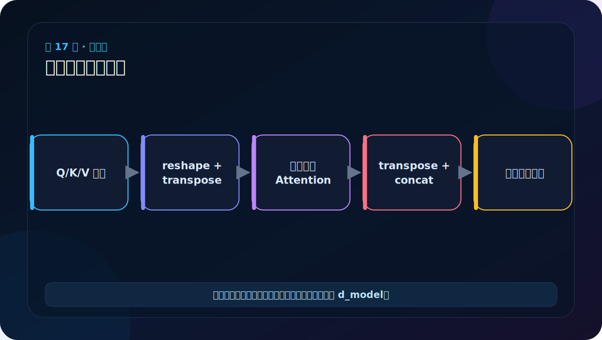
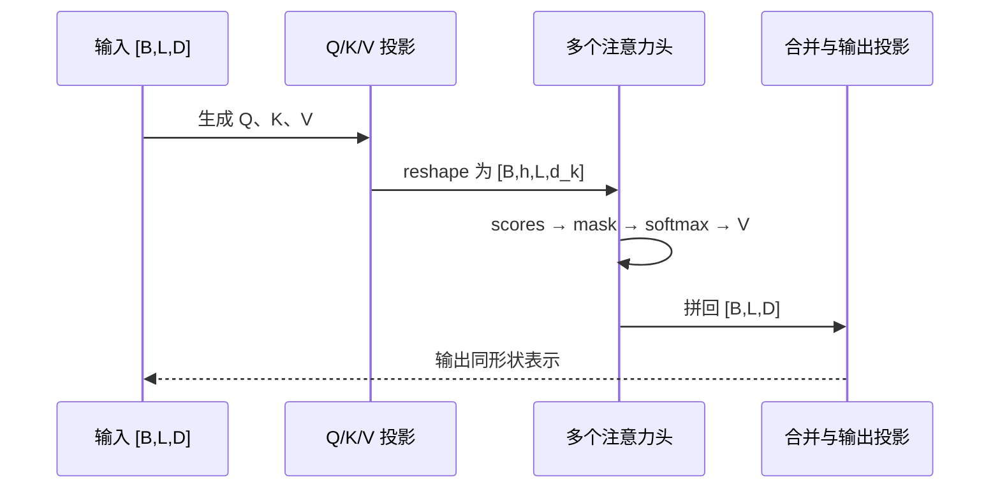

# 第 17 节：多头注意力原理下：拆头、计算、再合头

> 笔记编号 17/38 · 对应原视频 P122 · [打开这一集](https://www.bilibili.com/video/BV14mdfBDE4Q?p=122)

[← 上一节：16 多头注意力原理上：把特征空间分给多个头](./16-multi-head-attention-principle-upper.md) · [返回总目录](./README.md) · [下一节：18 MultiHeadedAttention 代码：四个线性层和形状重排 →](./18-multi-head-attention-code.md)

## 这节解决什么问题

多头完整过程有五步：投影 Q/K/V，重排成头维，每头独立注意力，拼回所有头，再做一次输出投影。



图要沿箭头或结构层级阅读。先说清楚数据从哪里来、形状怎样变化，再记组件名称。

## 老师原声整理稿（按讲解顺序）

### 0:00–1:54　把图解压缩成可复述的五步

老师不再画完整火锅图，而是把多头注意力写成文字流程：

1. Q、K、V 做线性变换；
2. reshape 并 transpose，拆成多头；
3. 每个头独立做注意力；
4. concatenate 各头结果；
5. 再做一次线性变换。

这里先投影再分头很重要。若只把原始 512 维机械切八段，不经过不同参数的 Q/K/V 投影，各头的表达能力和分工会受限。

### 1:54–4:45　分头前后元素总数不变

老师继续使用 [2,4,512]。512 拆成 8×64 后为 [2,4,8,64]，换轴后是 [2,8,4,64]。这只是重排，不是把一句话复制八份，也没有让 batch 变大。

可以用元素数自检：

```text
2×4×512 = 2×4×8×64 = 4096
```

若 reshape 前后元素数对不上，参数一定写错。

### 4:45–6:34　Concatenate 做什么

八个头各自得到 [2,1,4,64] 一类结果，沿特征方向拼回 [2,4,512]。老师把它说成汇总不同组的信息，让输出规整。

拼接本身只把分开的特征排回一条向量。随后输出 Linear 才能在各头特征之间重新混合，让模型学习怎样综合这些视角。

### 6:34–8:25　“八只眼睛”是帮助记忆的类比

老师用“八只眼睛看不同细节，最后汇总成整体”总结。类比要配合三条技术事实：

- 每只“眼睛”由不同的可学习投影形成；
- 每个头仍然看到整段可见序列；
- mask 通常沿 head 维广播，但各头算出的权重可以不同。

最后要能不靠类比写出形状路线。对于任意 B、L、D、h：

```text
[B,L,D] → [B,h,L,D/h] → attention → [B,h,L,D/h] → [B,L,D]
```

transpose 后张量内存可能不连续，代码在最终 view 前通常要调用 contiguous，或直接使用 reshape。

## 辅助流程图


### 注意力张量时序图



## 完整原声逐段记录

[查看本节按时间戳整理的完整音轨转写](./transcripts/p122.md)

这份逐段记录用于核查老师讲过的内容是否遗漏；学习时优先阅读上面的校正文章，遇到想追溯的细节再按时间戳查看原声记录。

## 零基础先记住

- [B,L,D] view 为 [B,L,h,dₖ]
- transpose 得到 [B,h,L,dₖ] 便于并行
- 合头后回到 [B,L,D]，模型其他层无需知道头的细节

## 最小可运行代码

下面代码默认从项目根目录运行。涉及模型组件时，使用 [transformer_from_scratch](../../transformer_from_scratch/README.md) 中经过测试的 PyTorch 实现。

```python
import torch
x = torch.randn(2, 5, 16)
h = 4
split = x.view(2, 5, h, 4).transpose(1, 2)
merged = split.transpose(1, 2).contiguous().view(2, 5, 16)
print(split.shape, merged.shape, torch.equal(x, merged))
```

### 输入和输出怎么看

拆头形状 [2,4,5,4]，合回 [2,5,16]，在没有中间计算时数值完全恢复。

## 最容易踩的坑

transpose 后内存通常不连续；用 view 合并前要 contiguous()，或谨慎使用 reshape。

## 本节知识链

`线性投影 → view+transpose → 各头 Attention → concat+输出投影`

Transformer 学习的主线始终是形状。每经过一个箭头，都问自己：batch、序列长度、特征维、头数和词表维中的哪一个发生了变化？

## 自测

**问题：为什么 Attention 计算时把 h 放在长度 L 前面？**

<details>
<summary>点开核对答案</summary>

这样张量是 [B,h,L,dₖ]，矩阵乘法可同时对 batch 和各头并行。

</details>

## 学完检查

- [ ] 我能不用术语解释本节组件解决的问题
- [ ] 我能在运行前写出关键张量形状
- [ ] 我能指出 Q、K、V 或 mask 的来源
- [ ] 我知道代码“形状正确但逻辑可能错误”的情况
- [ ] 我能独立回答自测题

[← 上一节：16 多头注意力原理上：把特征空间分给多个头](./16-multi-head-attention-principle-upper.md) · [返回总目录](./README.md) · [下一节：18 MultiHeadedAttention 代码：四个线性层和形状重排 →](./18-multi-head-attention-code.md)
