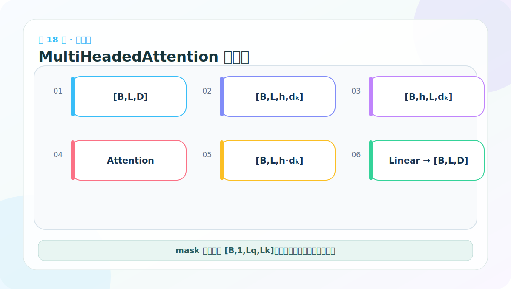
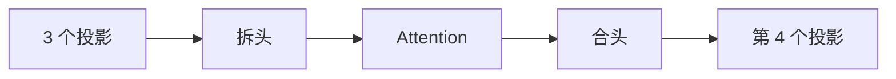
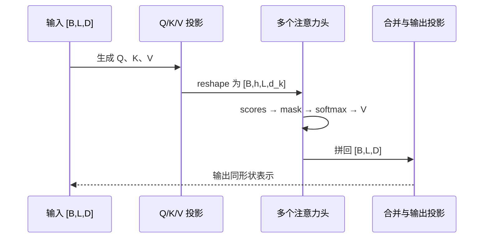

# 第 18 节：MultiHeadedAttention 代码：四个线性层和形状重排

> 笔记编号 18/38 · 对应原视频 P123 · [打开这一集](https://www.bilibili.com/video/BV14mdfBDE4Q?p=123)

[← 上一节：17 多头注意力原理下：拆头、计算、再合头](./17-multi-head-attention-principle-lower.md) · [返回总目录](./README.md) · [下一节：19 多头注意力测试：不能只检查“能运行” →](./19-multi-head-attention-test.md)

## 这节解决什么问题

前三个线性层分别产生 Q、K、V，第四个在线性拼接后融合各头。mask 增加 head 维后可广播给所有头。



图要沿箭头或结构层级阅读。先说清楚数据从哪里来、形状怎样变化，再记组件名称。

## 老师原声整理稿（按讲解顺序）

### 0:00–3:56　先写 clones：复制结构，但参数必须独立

老师先实现：

```python
def clones(module, N):
    return nn.ModuleList([copy.deepcopy(module) for _ in range(N)])
```

这个工具不只服务四个 Linear，后面 EncoderLayer、DecoderLayer 和残差子层也会反复用。deepcopy 会复制结构和参数张量；若只把同一个 module 引用放 N 次，所有位置会共享同一组参数。

ModuleList 让 PyTorch 正确注册子模块，优化器和 state_dict 才能看到它们。普通 Python list 虽能存对象，但不会自动完成模型参数管理。

### 3:56–7:55　初始化时先做整除断言

MultiHeadedAttention 接收 h、d_model、dropout。第一条检查是：

```python
assert d_model % h == 0
```

随后 `d_k=d_model//h`。例如 512//8=64。整除失败时尽早报错，比运行到 view 时出现难懂的元素数错误更容易定位。

类还保存 h、四个线性层、注意力权重占位和 Dropout。前三个 Linear 用于 Q/K/V，第四个用于合头后的输出投影。

### 7:55–10:58　为什么是四个 Linear

基础 Linear 的形状都是 D→D：

- linear[0]：WQ；
- linear[1]：WK；
- linear[2]：WV；
- linear[3]：WO。

前三个生成不同的 Q、K、V 表示。即使 Self-Attention 的原始输入相同，投影后也不再数值相等。第四个在线程结果拼接后融合各头信息。

### 10:58–15:18　先处理 mask 的 head 广播维

若 mask 不为 None，代码通常：

```python
mask = mask.unsqueeze(1)
```

例如 [B,L,L] 变成 [B,1,L,L]。这个 1 会广播到 h 个头，所以每个头遵守相同的因果/PAD 可见规则。若原 mask 已经带 head 维，再重复 unsqueeze 就会多一轴，因此项目要统一入口形状。

接着记录 `nbatches=query.size(0)`，不要把 batch 写死为 2。

### 15:18–21:34　用 zip 同时投影并拆分 Q/K/V

老师用列表推导和 zip，把三个 Linear 与 query、key、value 对应起来。每个张量依次经过：

```text
[B,L,D]
→ Linear [B,L,D]
→ view [B,L,h,d_k]
→ transpose [B,h,L,d_k]
```

若 Q 与 K 的长度不同，view 中必须使用各自 `x.size(1)`，不能统一拿 Query 长度。这样同一实现才能支持 Cross-Attention 的 Lt 与 Ls。

### 21:34–24:38　调用单头函数，再合并各头

拆好后调用前面完成的 `attention(query,key,value,mask,dropout)`，得到 x=[B,h,Lq,d_k] 与权重 [B,h,Lq,Lk]。

合头路线：

```python
x = x.transpose(1, 2).contiguous()
x = x.view(nbatches, -1, h * d_k)
```

transpose 后先 contiguous，因为换轴后的 stride 可能不允许直接 view。最终恢复 [B,Lq,D]。

### 24:38–25:07　最后输出投影

`return self.linears[-1](x)` 用第四个 Linear 混合拼接后的头特征。输出保持 [B,Lq,D]，以便残差连接。

实现完成后，用三条路线复查：

- 参数路线：4 个独立 Linear；
- 形状路线：[B,L,D]↔[B,h,L,d_k]；
- mask 路线：[B,Lq,Lk]→[B,1,Lq,Lk]。

这三条任意一条混乱，代码都可能形状报错或悄悄做错注意力。

## 辅助流程图



### 注意力张量时序图



## 完整原声逐段记录

[查看本节按时间戳整理的完整音轨转写](./transcripts/p123.md)

这份逐段记录用于核查老师讲过的内容是否遗漏；学习时优先阅读上面的校正文章，遇到想追溯的细节再按时间戳查看原声记录。

## 零基础先记住

- 使用深拷贝保证四个 Linear 参数独立
- 保存 self.attn 方便调试和可视化
- 常见 mask 扩为 [B,1,Lq,Lk]

## 最小可运行代码

下面代码默认从项目根目录运行。涉及模型组件时，使用 [transformer_from_scratch](../../transformer_from_scratch/README.md) 中经过测试的 PyTorch 实现。

```python
import torch
from transformer_from_scratch.model import MultiHeadedAttention, subsequent_mask
layer = MultiHeadedAttention(h=4, d_model=16, dropout=0.0)
x = torch.randn(2, 5, 16)
y = layer(x, x, x, subsequent_mask(5))
print(y.shape, layer.attn.shape)
```

### 输入和输出怎么看

输出 [2,5,16]；注意力权重为 [2,4,5,5]，包含 2 个 batch、4 个头。

## 最容易踩的坑

把同一个 nn.Linear 对象重复放进列表会共享权重；需要 deepcopy，而不是只复制引用。

## 本节知识链

`3 个投影 → 拆头 → Attention → 合头 → 第 4 个投影`

Transformer 学习的主线始终是形状。每经过一个箭头，都问自己：batch、序列长度、特征维、头数和词表维中的哪一个发生了变化？

## 自测

**问题：为什么代码需要 4 个 d_model→d_model 的线性层？**

<details>
<summary>点开核对答案</summary>

三个分别投影 Q/K/V，最后一个融合拼接后的多头输出。

</details>

## 学完检查

- [ ] 我能不用术语解释本节组件解决的问题
- [ ] 我能在运行前写出关键张量形状
- [ ] 我能指出 Q、K、V 或 mask 的来源
- [ ] 我知道代码“形状正确但逻辑可能错误”的情况
- [ ] 我能独立回答自测题

[← 上一节：17 多头注意力原理下：拆头、计算、再合头](./17-multi-head-attention-principle-lower.md) · [返回总目录](./README.md) · [下一节：19 多头注意力测试：不能只检查“能运行” →](./19-multi-head-attention-test.md)
