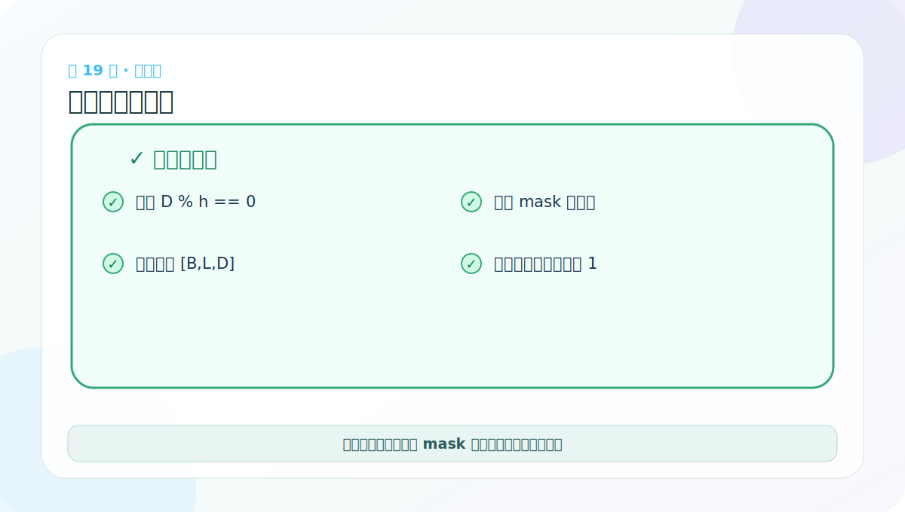
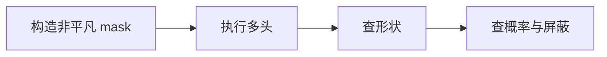
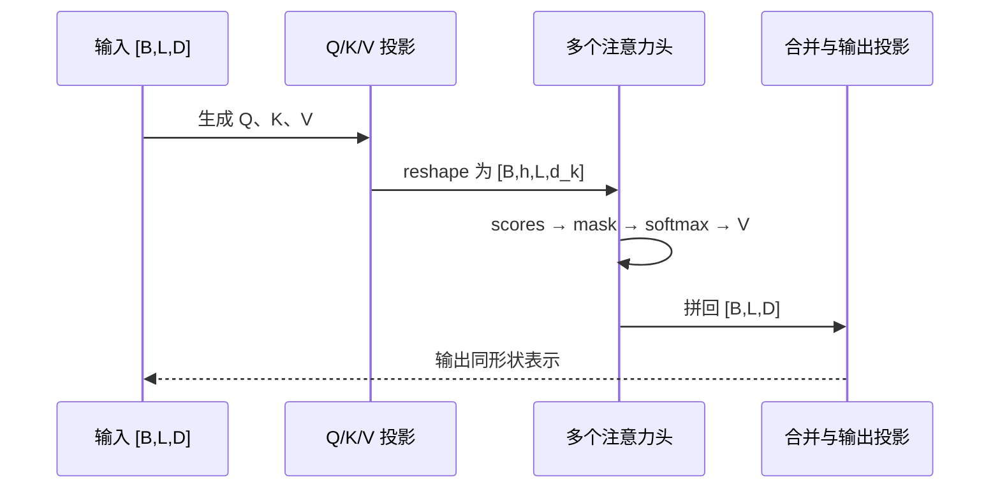

# 第 19 节：多头注意力测试：不能只检查“能运行”

> 笔记编号 19/38 · 对应原视频 P124 · [打开这一集](https://www.bilibili.com/video/BV14mdfBDE4Q?p=124)

[← 上一节：18 MultiHeadedAttention 代码：四个线性层和形状重排](./18-multi-head-attention-code.md) · [返回总目录](./README.md) · [下一节：20 Position-wise FFN：每个位置独立加工特征 →](./20-positionwise-feed-forward.md)

## 这节解决什么问题

好的测试要同时检查输出形状、每头权重形状、概率和，以及 mask 后未来位置是否真的为 0。



图要沿箭头或结构层级阅读。先说清楚数据从哪里来、形状怎样变化，再记组件名称。

## 老师原声整理稿（按讲解顺序）

### 0:00–3:41　测试函数继续复用输入端结果

老师创建 MultiHeadedAttention(h=8,d_model=512)，并把已经经过 Embedding 与位置编码的 [2,4,512] 张量作为 Self-Attention 的 Q、K、V。

因为是自注意力，三者来自同一输入；但进入模块后会分别通过 WQ、WK、WV，所以投影结果不同。测试代码返回多头输出，方便后续 EncoderLayer 直接使用。

### 3:41–6:42　先故意改头数，看整除检查是否生效

课堂把头数从可整除设置改成不合适值，触发 assert 或 reshape 错误，再改回 8。这个实验验证了 d_model%h==0 不是装饰。

当 D=512、h=8，每头 64 维；输出仍应为 [2,4,512]。若只看最终 shape，可能漏掉内部错误，因此还要查看 `self.attn` 的 [2,8,4,4]。

### 6:42–10:39　课堂现场定位 transpose/view 问题

老师沿源码回看 view 与 transpose 的轴顺序，并解释 batch_size 不应写死。拆头需要 [B,L,h,d_k]→[B,h,L,d_k]；合头要反过来，再 contiguous/view。

当 shape 报错时，最有效的做法不是随意改 -1，而是逐行打印：

- Linear 后；
- view 后；
- transpose 后；
- attention 后；
- 合头后。

每一步与纸面路线比对，错误会被限制在一行。

### 10:39–13:36　transpose、view 与内存顺序

老师补充张量在内存中按顺序存储。transpose 只交换两个轴的视图，底层 stride 会改变；view 要求新形状与内存布局兼容，所以合头前调用 contiguous。

`view` 可一次重塑多个维度，`transpose` 一次交换两个指定轴。二者职责不同，不能把“改变显示形状”统称为同一个操作。

### 13:36–15:20　权重 shape 的语义

对 batch=2、长度=4、头数=8：

```text
output: [2,4,512]
attn:   [2,8,4,4]
```

attn 中每个 [4,4] 表示一个头里四个 Query 对四个 Key 的权重。每一行沿最后维应和为 1；若传因果 mask，上三角应为 0。

课堂主要打印形状。更严格测试还应将 dropout=0，并断言：

```python
assert torch.allclose(attn.sum(-1), torch.ones_like(attn.sum(-1)))
```

不要使用全 1 mask 作为唯一测试，因为它无法证明遮盖代码真正生效；至少准备一个同时含允许与禁止格子的 mask。

## 辅助流程图



### 注意力张量时序图



## 完整原声逐段记录

[查看本节按时间戳整理的完整音轨转写](./transcripts/p124.md)

这份逐段记录用于核查老师讲过的内容是否遗漏；学习时优先阅读上面的校正文章，遇到想追溯的细节再按时间戳查看原声记录。

## 零基础先记住

- 使用带 0 和 1 的非平凡 mask
- 检查 attention.sum(-1)≈1
- 检查严格上三角权重全为 0

## 最小可运行代码

下面代码默认从项目根目录运行。涉及模型组件时，使用 [transformer_from_scratch](../../transformer_from_scratch/README.md) 中经过测试的 PyTorch 实现。

```python
import torch
from transformer_from_scratch.model import MultiHeadedAttention, subsequent_mask
layer = MultiHeadedAttention(4, 16, dropout=0.0)
y = layer(*(torch.randn(2, 5, 16),) * 3, mask=subsequent_mask(5))
print(y.shape)
print(torch.allclose(layer.attn.sum(-1), torch.ones(2, 4, 5), atol=1e-6))
```

### 输入和输出怎么看

输出形状正确，第二行应为 True，说明每个 Query、每个头的权重已归一化。

## 最容易踩的坑

全 1 mask 只能证明广播没有报错，无法证明屏蔽逻辑正确；全 0 mask 又会制造没有合法位置的异常情形。

## 本节知识链

`构造非平凡 mask → 执行多头 → 查形状 → 查概率与屏蔽`

Transformer 学习的主线始终是形状。每经过一个箭头，都问自己：batch、序列长度、特征维、头数和词表维中的哪一个发生了变化？

## 自测

**问题：为什么测试时把 dropout 设为 0？**

<details>
<summary>点开核对答案</summary>

Dropout 会随机改变注意力权重和，使确定性断言复杂；组件性质测试应先关闭随机性。

</details>

## 学完检查

- [ ] 我能不用术语解释本节组件解决的问题
- [ ] 我能在运行前写出关键张量形状
- [ ] 我能指出 Q、K、V 或 mask 的来源
- [ ] 我知道代码“形状正确但逻辑可能错误”的情况
- [ ] 我能独立回答自测题

[← 上一节：18 MultiHeadedAttention 代码：四个线性层和形状重排](./18-multi-head-attention-code.md) · [返回总目录](./README.md) · [下一节：20 Position-wise FFN：每个位置独立加工特征 →](./20-positionwise-feed-forward.md)
