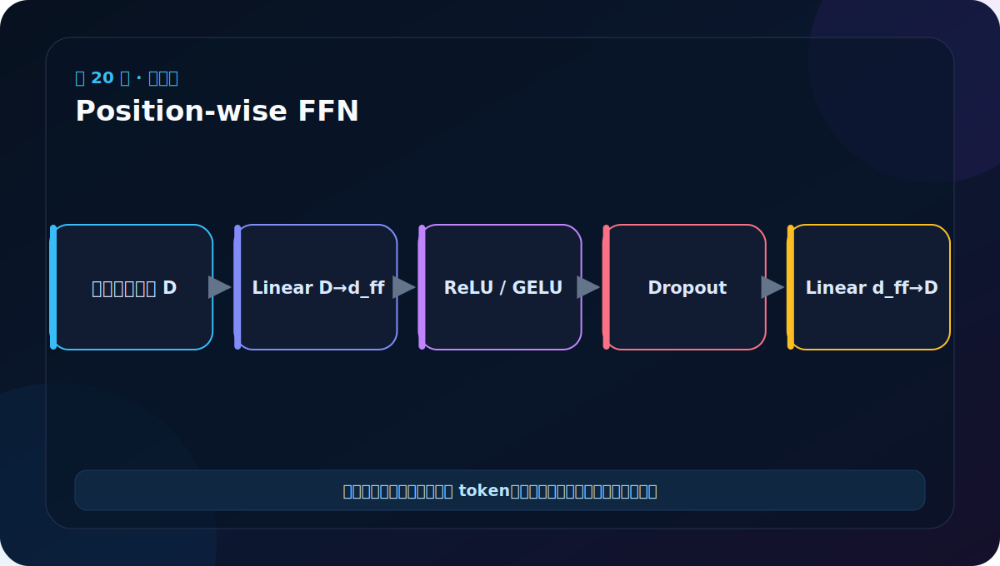
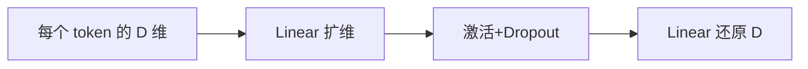

# 第 20 节：Position-wise FFN：每个位置独立加工特征

> 笔记编号 20/38 · 对应原视频 P125 · [打开这一集](https://www.bilibili.com/video/BV14mdfBDE4Q?p=125)

[← 上一节：19 多头注意力测试：不能只检查“能运行”](./19-multi-head-attention-test.md) · [返回总目录](./README.md) · [下一节：21 LayerNorm 代码：在每个 token 内标准化特征 →](./21-layer-normalization-code.md)

## 这节解决什么问题

注意力负责在词之间交换信息，FFN 负责在每个词内部对特征做非线性变换。所有位置共享同一组两层网络参数。



图要沿箭头或结构层级阅读。先说清楚数据从哪里来、形状怎样变化，再记组件名称。

## 老师原声整理稿（按讲解顺序）

### 0:00–2:47　Attention 交流位置，FFN 加工特征

老师先解释前馈全连接子层的作用。注意力把不同 token 的信息汇总到当前位置，但一次线性加权未必能充分提取复杂特征；FFN 再对每个位置做更强的非线性变换。

“Position-wise”不是每个位置各有一套参数，而是所有位置共享同一组网络，分别处理各自向量。可以类比同一位老师用同一套方法分别辅导每名学生；学生输入不同，结果不同，但规则相同。

### 2:47–4:45　为什么先升维再降维

原始 Transformer 常用 d_model=512、d_ff=2048：

```text
512 → 2048 → 512
```

先扩到更宽的隐藏空间并加入 ReLU，模型能组合出更多非线性特征；再投回 512，才能与子层输入做残差相加，并继续保持各层统一接口。

扩维不是增加序列长度。输入 [B,L,512] 经第一层变 [B,L,2048]，B、L 不变。

### 4:45–7:43　类中保存两个 Linear 与 Dropout

PositionwiseFeedForward 初始化 d_model、d_ff、dropout：

```python
self.w_1 = nn.Linear(d_model, d_ff)
self.w_2 = nn.Linear(d_ff, d_model)
self.dropout = nn.Dropout(dropout)
```

前向路线：

```python
return self.w_2(self.dropout(F.relu(self.w_1(x))))
```

顺序是 Linear→ReLU→Dropout→Linear。课程版本通常不在第二个 Linear 后再加激活，因为后面还有残差与 LayerNorm。

### 7:43–10:40　测试只改变中间维，最终 shape 还原

用 [2,4,512] 输入，w_1 输出 [2,4,2048]，w_2 输出 [2,4,512]。老师建议把 d_ff 作为初始化参数而不是写死，测试时可换小维度观察。

FFN 不会把位置 0 和位置 3 直接相乘；每个位置的 512 维向量独立经过相同两层网络。跨 token 关系已经由前面的 Attention 写入每个位置的向量。

### 10:40–11:57　老师强调“先能讲出来，再扣代码”

课程最后把 Transformer 与现代大模型联系起来：Encoder 路线常服务理解任务，Decoder 路线常服务生成任务。课堂口述中把 NLU/NLG 名称说得有些混乱，标准含义是 Natural Language Understanding 与 Natural Language Generation。

老师建议晚上重新梳理代码，第一目标不是逐字符背诵，而是能用自己的话说清每个组件的作用和 shape。对 FFN，合格回答至少包含：

> 注意力完成位置间通信；FFN 对每个位置共享参数地做 512→2048→512 非线性加工；输出维度还原是为了残差连接。

## 辅助流程图




## 完整原声逐段记录

[查看本节按时间戳整理的完整音轨转写](./transcripts/p125.md)

这份逐段记录用于核查老师讲过的内容是否遗漏；学习时优先阅读上面的校正文章，遇到想追溯的细节再按时间戳查看原声记录。

## 零基础先记住

- 形状 D→d_ff→D，通常 d_ff 大于 D
- 对每个位置独立，因此不混合 L 维
- 中间使用 ReLU/GELU 和 Dropout 提供非线性与正则化

## 最小可运行代码

下面代码默认从项目根目录运行。涉及模型组件时，使用 [transformer_from_scratch](../../transformer_from_scratch/README.md) 中经过测试的 PyTorch 实现。

```python
import torch
from transformer_from_scratch.model import PositionwiseFeedForward
layer = PositionwiseFeedForward(d_model=16, d_ff=64, dropout=0.0)
x = torch.randn(2, 5, 16)
print(layer(x).shape)
```

### 输入和输出怎么看

输出仍是 [2,5,16]；中间曾扩展到 64 维，但第二个线性层又投回 16 维。

## 最容易踩的坑

Position-wise 不代表每个位置有一套独立参数；恰恰是所有位置复用同一 FFN。

## 本节知识链

`每个 token 的 D 维 → Linear 扩维 → 激活+Dropout → Linear 还原 D`

Transformer 学习的主线始终是形状。每经过一个箭头，都问自己：batch、序列长度、特征维、头数和词表维中的哪一个发生了变化？

## 自测

**问题：FFN 会把第 2 个词的信息传到第 5 个词吗？**

<details>
<summary>点开核对答案</summary>

不会。跨位置交流由注意力完成，FFN 只处理各位置自身的特征向量。

</details>

## 学完检查

- [ ] 我能不用术语解释本节组件解决的问题
- [ ] 我能在运行前写出关键张量形状
- [ ] 我能指出 Q、K、V 或 mask 的来源
- [ ] 我知道代码“形状正确但逻辑可能错误”的情况
- [ ] 我能独立回答自测题

[← 上一节：19 多头注意力测试：不能只检查“能运行”](./19-multi-head-attention-test.md) · [返回总目录](./README.md) · [下一节：21 LayerNorm 代码：在每个 token 内标准化特征 →](./21-layer-normalization-code.md)
