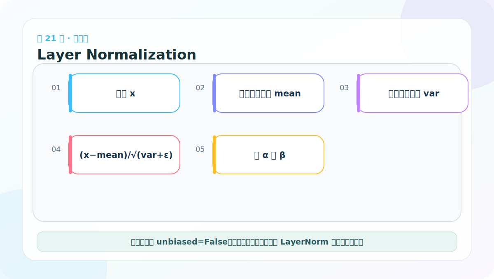
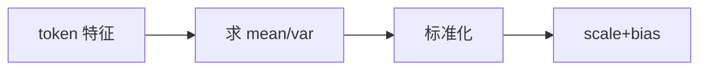

# 第 21 节：LayerNorm 代码：在每个 token 内标准化特征

> 笔记编号 21/38 · 对应原视频 P126 · [打开这一集](https://www.bilibili.com/video/BV14mdfBDE4Q?p=126)

[← 上一节：20 Position-wise FFN：每个位置独立加工特征](./20-positionwise-feed-forward.md) · [返回总目录](./README.md) · [下一节：22 LayerNorm 测试：均值约 0、方差约 1 →](./22-layer-normalization-test.md)

## 这节解决什么问题

对每个 token 的 D 个特征计算均值和方差，标准化后再用可学习 scale 与 bias 调整。它不依赖同批次的其他样本。



图要沿箭头或结构层级阅读。先说清楚数据从哪里来、形状怎样变化，再记组件名称。

## 老师原声整理稿（按讲解顺序）

### 0:00–4:51　为什么深层网络需要归一化

老师从装修铺砖、汽车保养作类比：每一步只有一点小偏差，层层累积后可能越来越严重。神经网络也会遇到中间激活尺度漂移、梯度不稳定等问题，归一化帮助各层输入保持更可控的数值分布。

LayerNorm 先对指定特征求均值与标准差，标准化后再乘可学习缩放 a、加可学习偏移 b。后两步很重要：模型可以在稳定训练的同时，重新学回任务需要的尺度和中心。

### 4:51–9:48　代码放在哪里，以及类的职责

老师继续在组件文件中定义 LayerNorm，并提醒把长文件中的代码折叠管理。后面的 Sublayer、EncoderLayer、Encoder、DecoderLayer、Decoder 都会复用它，所以现在必须把接口写稳定。

类继承 nn.Module，接收 features=d_model 和 eps。features 决定 a、b 的长度；eps 是防止标准差为 0 时除零的小常数。

### 9:48–13:46　可学习参数 a 和 b

构造函数创建：

```python
self.a_2 = nn.Parameter(torch.ones(features))
self.b_2 = nn.Parameter(torch.zeros(features))
```

a 初始为 1，b 初始为 0，所以初始化时不会额外改变标准化结果。nn.Parameter 让它们参与反向传播。名称 a_2/b_2 是课程/经典实现的命名，不表示平方运算。

老师用线性公式 y=kx+b 回顾缩放和平移：a 控制每个特征维的幅度，b 控制中心偏移。

### 13:46–16:43　沿最后一维求均值与标准差

输入 x=[B,L,D]，LayerNorm 对每个 batch、每个 token 的 D 个特征独立归一化：

```python
mean = x.mean(-1, keepdim=True)  # [B,L,1]
std = x.std(-1, keepdim=True)    # [B,L,1]
```

keepdim=True 保留最后一个长度为 1 的轴，后面才能自动广播回 [B,L,D]。它不会把 batch 中不同句子混在一起，也不会把不同 token 的均值合并。

### 16:43–21:20　标准化、缩放和平移

前向返回：

```python
self.a_2 * (x - mean) / (std + self.eps) + self.b_2
```

x-mean 让每个位置的特征中心接近 0；除以 std 让尺度接近 1；eps 防止常量向量造成除零；a、b 再提供可学习自由度。

需要注意课程手写实现常用 PyTorch `std` 默认的样本标准差，而框架 `nn.LayerNorm` 使用总体方差定义。为了严格对齐官方实现，配套代码使用 `var(unbiased=False)` 或 `std(unbiased=False)`。差异在小 D 测试中会看得比较明显。

## 辅助流程图




## 完整原声逐段记录

[查看本节按时间戳整理的完整音轨转写](./transcripts/p126.md)

这份逐段记录用于核查老师讲过的内容是否遗漏；学习时优先阅读上面的校正文章，遇到想追溯的细节再按时间戳查看原声记录。

## 零基础先记住

- 归一化轴是最后一维 D
- unbiased=False 才与框架 LayerNorm 的总体方差定义一致
- scale 初始为 1，bias 初始为 0

## 最小可运行代码

下面代码默认从项目根目录运行。涉及模型组件时，使用 [transformer_from_scratch](../../transformer_from_scratch/README.md) 中经过测试的 PyTorch 实现。

```python
import torch
from transformer_from_scratch.model import LayerNorm
x = torch.randn(2, 4, 8)
y = LayerNorm(8)(x)
print(y.shape)
print(y.mean(-1).round(decimals=5))
```

### 输入和输出怎么看

形状保持 [2,4,8]；每个 token 沿最后一维的均值约为 0。

## 最容易踩的坑

课程手写方差若使用默认无偏估计，会与 nn.LayerNorm 有小差异；本项目明确使用 unbiased=False。

## 本节知识链

`token 特征 → 求 mean/var → 标准化 → scale+bias`

Transformer 学习的主线始终是形状。每经过一个箭头，都问自己：batch、序列长度、特征维、头数和词表维中的哪一个发生了变化？

## 自测

**问题：输入 [B,L,D] 时，LayerNorm 会把不同句子的同一特征混在一起统计吗？**

<details>
<summary>点开核对答案</summary>

不会。它对每个 [D] 向量独立统计。

</details>

## 学完检查

- [ ] 我能不用术语解释本节组件解决的问题
- [ ] 我能在运行前写出关键张量形状
- [ ] 我能指出 Q、K、V 或 mask 的来源
- [ ] 我知道代码“形状正确但逻辑可能错误”的情况
- [ ] 我能独立回答自测题

[← 上一节：20 Position-wise FFN：每个位置独立加工特征](./20-positionwise-feed-forward.md) · [返回总目录](./README.md) · [下一节：22 LayerNorm 测试：均值约 0、方差约 1 →](./22-layer-normalization-test.md)
