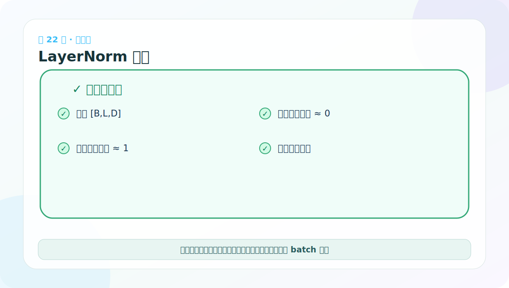

# 第 22 节：LayerNorm 测试：均值约 0、方差约 1

> 笔记编号 22/38 · 对应原视频 P127 · [打开这一集](https://www.bilibili.com/video/BV14mdfBDE4Q?p=127)

[← 上一节：21 LayerNorm 代码：在每个 token 内标准化特征](./21-layer-normalization-code.md) · [返回总目录](./README.md) · [下一节：23 BatchNorm 与 LayerNorm：统计方向不同 →](./23-batchnorm-vs-layernorm.md)

## 这节解决什么问题

测试要沿正确轴计算统计量，并允许浮点误差。还要检查输出形状和参数是否可学习。



图要沿箭头或结构层级阅读。先说清楚数据从哪里来、形状怎样变化，再记组件名称。

## 老师原声整理稿（按讲解顺序）

### 0:00–3:40　测试沿真实子层路线取数据

老师复用前面多头注意力和 FFN 的输出，再送入 LayerNorm：

```text
输入 → 多头注意力 → Position-wise FFN → LayerNorm
```

这样可验证组件衔接时 shape 一直是 [2,4,512]。不过它属于小型集成测试；LayerNorm 还应直接使用可控输入做单元测试。

### 3:40–5:30　归一化不会改变 shape

老师打印注意力、FFN 与 LayerNorm 的结果，它们都是 [2,4,512]。LayerNorm 改变每个 token 特征的数值分布，不改变 batch、序列长度和特征数。正因为接口不变，才能插在深层网络的子层之间。

### 5:30–7:08　真正该验证的是均值、方差和边界

沿最后一维检查：

```python
y = norm(x)
assert torch.allclose(y.mean(-1), torch.zeros_like(y.mean(-1)), atol=1e-5)
assert torch.allclose(
    y.var(-1, unbiased=False),
    torch.ones_like(y.var(-1, unbiased=False)),
    atol=1e-4,
)
```

由于 eps、浮点误差和可学习 a/b，不能用完全相等。实现和测试还必须使用一致的 unbiased 定义。

再加入所有特征相同的常量向量，确认输出不含 NaN/Inf，才能证明 eps 在零方差场景生效。LayerNorm 与残差共同提高深层训练稳定性，但它不是保证梯度永不消失的万能公式。

## 辅助流程图


## 完整原声逐段记录

[查看本节按时间戳整理的完整音轨转写](./transcripts/p127.md)

这份逐段记录用于核查老师讲过的内容是否遗漏；学习时优先阅读上面的校正文章，遇到想追溯的细节再按时间戳查看原声记录。

## 零基础先记住

- 使用 atol 容忍数值误差
- 方差断言应与实现的 eps 和定义一致
- 极端常量输入不会除零，因为有 eps

## 最小可运行代码

下面代码默认从项目根目录运行。涉及模型组件时，使用 [transformer_from_scratch](../../transformer_from_scratch/README.md) 中经过测试的 PyTorch 实现。

```python
import torch
from transformer_from_scratch.model import LayerNorm
x = torch.randn(3, 5, 16)
y = LayerNorm(16)(x)
print(torch.allclose(y.mean(-1), torch.zeros(3, 5), atol=1e-5))
print(torch.allclose(y.var(-1, unbiased=False), torch.ones(3, 5), atol=2e-5))
```

### 输入和输出怎么看

通常输出两个 True，分别验证最后一维均值和方差。

## 最容易踩的坑

直接用 == 比较浮点数很脆弱；应使用 torch.allclose 并给合理容差。

## 本节知识链

`随机输入 → LayerNorm → 按 D 求统计 → allclose 断言`

Transformer 学习的主线始终是形状。每经过一个箭头，都问自己：batch、序列长度、特征维、头数和词表维中的哪一个发生了变化？

## 自测

**问题：为什么常量向量标准化后不会产生 NaN？**

<details>
<summary>点开核对答案</summary>

分母加入 eps；方差为 0 时仍有正数可除，结果接近全 0 再经过 scale/bias。

</details>

## 学完检查

- [ ] 我能不用术语解释本节组件解决的问题
- [ ] 我能在运行前写出关键张量形状
- [ ] 我能指出 Q、K、V 或 mask 的来源
- [ ] 我知道代码“形状正确但逻辑可能错误”的情况
- [ ] 我能独立回答自测题

[← 上一节：21 LayerNorm 代码：在每个 token 内标准化特征](./21-layer-normalization-code.md) · [返回总目录](./README.md) · [下一节：23 BatchNorm 与 LayerNorm：统计方向不同 →](./23-batchnorm-vs-layernorm.md)
