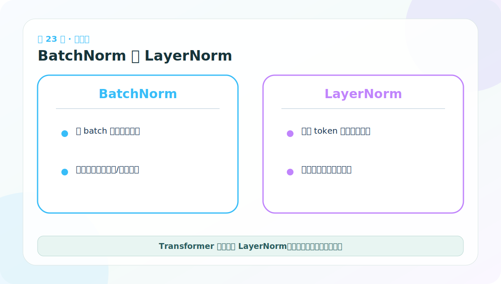

# 第 23 节：BatchNorm 与 LayerNorm：统计方向不同

> 笔记编号 23/38 · 对应原视频 P128 · [打开这一集](https://www.bilibili.com/video/BV14mdfBDE4Q?p=128)

[← 上一节：22 LayerNorm 测试：均值约 0、方差约 1](./22-layer-normalization-test.md) · [返回总目录](./README.md) · [下一节：24 SublayerConnection：残差、Dropout 与归一化 →](./24-sublayer-connection-code.md)

## 这节解决什么问题

BatchNorm 通常跨 batch 统计同一特征，LayerNorm 在一个样本/词元内部跨特征统计。序列长度和批量变化时，LayerNorm 更稳定。



图要沿箭头或结构层级阅读。先说清楚数据从哪里来、形状怎样变化，再记组件名称。

## 老师原声整理稿（按讲解顺序）

### 0:00–1:53　两者公式相似，关键差异是统计轴

老师把 Layer Normalization（LN）与 Batch Normalization（BN）画在同一张表里。二者都做“减均值、除标准差、再缩放平移”，最重要的区别不是公式，而是哪些元素一起计算统计量。

### 1:53–4:52　BatchNorm 竖着看：同一特征跨样本

老师用表格的每一行表示样本、每一列表示特征。BatchNorm 对同一列跨多个样本统计，因此可形象理解为“竖着归一化”。

它依赖 batch 统计量：训练时用当前批次的均值/方差并更新运行统计；推理时通常使用累计的 running mean/variance。batch 太小或样本长度/分布变化大时，统计可能不稳定。

在卷积网络中还会把空间维一起纳入统计，不能只把二维表格规则原封不动套到所有张量；核心仍是“同一通道/特征跨样本统计”。

### 4:52–6:49　LayerNorm 横着看：单个 token 跨特征

LayerNorm 对每个样本内部、每个 token 的 D 个特征统计，可理解为“横着归一化”。它不依赖同 batch 还有多少句子，训练和推理使用相同的即时统计方式。

对 [B,L,D]：

- BN 的具体轴取决于布局和模块设计；
- LN(D) 明确沿最后的 D 维做。

Transformer 常面对变长文本、小 batch 或自回归逐 token 推理，LayerNorm 更自然，因此成为常用选择。

### 结论不要背成绝对规则

“文本只能用 LN、图片只能用 BN”过于绝对。选择归一化方式要看数据布局、batch 大小、训练方式和架构。卷积视觉模型仍广泛使用 BN，视觉 Transformer 也常使用 LN；还有 RMSNorm、GroupNorm 等选择。

面试回答最好先画统计轴，再说训练/推理差异和适用场景，这比只背“Transformer 用 LN”更可靠。

## 辅助流程图


## 完整原声逐段记录

[查看本节按时间戳整理的完整音轨转写](./transcripts/p128.md)

这份逐段记录用于核查老师讲过的内容是否遗漏；学习时优先阅读上面的校正文章，遇到想追溯的细节再按时间戳查看原声记录。

## 零基础先记住

- BatchNorm 依赖批次统计及训练/推理状态
- LayerNorm 对每个 token 独立，不依赖 batch 大小
- Transformer 通常使用 LayerNorm

## 最小可运行代码

下面代码默认从项目根目录运行。涉及模型组件时，使用 [transformer_from_scratch](../../transformer_from_scratch/README.md) 中经过测试的 PyTorch 实现。

```python
import torch
x = torch.randn(2, 3, 4)  # [B,L,D]
print("LayerNorm统计后形状：", x.mean(dim=-1).shape)
print("若跨batch统计形状：", x.mean(dim=0).shape)
```

### 输入和输出怎么看

LayerNorm 风格统计得到 [B,L]；跨 batch 统计得到 [L,D]，两者混合数据的方向完全不同。

## 最容易踩的坑

BN 和 LN 不是谁绝对更高级；卷积视觉任务常用 BN，选择取决于结构、数据和批次特性。

## 本节知识链

`输入 [B,L,D] → 选择统计轴 → BN 跨样本 → LN 跨特征`

Transformer 学习的主线始终是形状。每经过一个箭头，都问自己：batch、序列长度、特征维、头数和词表维中的哪一个发生了变化？

## 自测

**问题：batch size=1 时，哪一种通常更自然适合 Transformer？**

<details>
<summary>点开核对答案</summary>

LayerNorm，因为它不需要依赖其他样本估计统计量。

</details>

## 学完检查

- [ ] 我能不用术语解释本节组件解决的问题
- [ ] 我能在运行前写出关键张量形状
- [ ] 我能指出 Q、K、V 或 mask 的来源
- [ ] 我知道代码“形状正确但逻辑可能错误”的情况
- [ ] 我能独立回答自测题

[← 上一节：22 LayerNorm 测试：均值约 0、方差约 1](./22-layer-normalization-test.md) · [返回总目录](./README.md) · [下一节：24 SublayerConnection：残差、Dropout 与归一化 →](./24-sublayer-connection-code.md)
