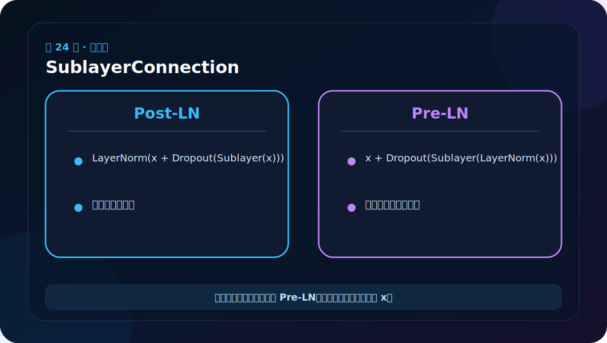
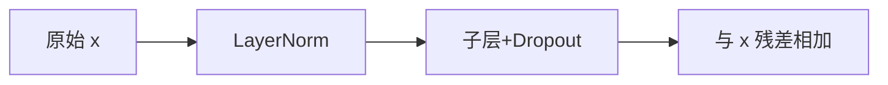

# 第 24 节：SublayerConnection：残差、Dropout 与归一化

> 笔记编号 24/38 · 对应原视频 P129 · [打开这一集](https://www.bilibili.com/video/BV14mdfBDE4Q?p=129)

[← 上一节：23 BatchNorm 与 LayerNorm：统计方向不同](./23-batchnorm-vs-layernorm.md) · [返回总目录](./README.md) · [下一节：25 子层连接测试：用 lambda 注入不同组件 →](./25-sublayer-connection-test.md)

## 这节解决什么问题

残差连接保留原始 x，再加上子层学到的改变量。Pre-LN 先规范化再进入子层，公式是 x + Dropout(Sublayer(LN(x)))。



图要沿箭头或结构层级阅读。先说清楚数据从哪里来、形状怎样变化，再记组件名称。

## 老师原声整理稿（按讲解顺序）

### 0:00–2:39　子层像积木外壳，Attention 与 FFN 都能装进去

前面的 Multi-Head Attention 和 FFN 是不同计算，但它们外面都需要归一化、Dropout 与残差连接。老师把共同流程封装成 SublayerConnection，避免在 Encoder/Decoder 中重复同一段代码。

EncoderLayer 有两个这样的外壳：一个包 Self-Attention，一个包 FFN；DecoderLayer 有三个。外壳只要求内部函数接收 x 并返回与 x 同形状张量。

### 2:39–6:17　新文件导入已有组件

老师新建语义化模块，并导入 LayerNorm、MultiHeadedAttention、PositionwiseFeedForward 等。现在进入“用零件组层”的阶段，文件依赖应从上层指向下层，基础组件不要反向导入完整 Encoder。

SublayerConnection 构造函数接收 size 与 dropout，内部创建 LayerNorm(size) 和 Dropout。

### 6:17–10:03　forward 为什么接收一个可调用 sublayer

接口大致为：

```python
def forward(self, x, sublayer):
    ...
```

sublayer 不是固定类名，而是一个可调用对象。传入注意力 lambda 时，它完成 Q/K/V 与 mask；传入 FFN 时，它直接加工 x。这样同一外壳不必知道内部细节。

### 10:03–14:54　残差路线必须保留原始 x

课程采用经典 Annotated Transformer 的 Pre-LN 写法：

```python
return x + self.dropout(sublayer(self.norm(x)))
```

数据分两路：

- 直连路：原始 x 不变地走到加号；
- 变换路：x→LayerNorm→具体子层→Dropout。

两路同形相加，输出 shape 不变。残差让深层网络容易保留已有信息，也为梯度提供较短通道。

### 14:54–16:21　Pre-LN 与原论文图不要混

原始论文架构图常表示 Post-LN：`Norm(x+Dropout(Sublayer(x)))`；课程累计代码采用 Pre-LN：`x+Dropout(Sublayer(Norm(x)))`。两者都是真实设计，但顺序不同。

学习本项目时以实际代码为准，不能图上背一套、代码里拼另一套。无论哪种形式，残差相加都要求子层输出与 x 完全同形；若 FFN 忘记投回 d_model，或多头没合回 D，就会在这里报错。

## 辅助流程图




## 完整原声逐段记录

[查看本节按时间戳整理的完整音轨转写](./transcripts/p129.md)

这份逐段记录用于核查老师讲过的内容是否遗漏；学习时优先阅读上面的校正文章，遇到想追溯的细节再按时间戳查看原声记录。

## 零基础先记住

- 本项目采用 Pre-LN，深层训练通常更稳定
- 残差相加要求子层输出与 x 形状一致
- 课程中某次现场书写的顺序需与最终架构约定区分

## 最小可运行代码

下面代码默认从项目根目录运行。涉及模型组件时，使用 [transformer_from_scratch](../../transformer_from_scratch/README.md) 中经过测试的 PyTorch 实现。

```python
import torch
from transformer_from_scratch.model import SublayerConnection
layer = SublayerConnection(size=8, dropout=0.0)
x = torch.randn(2, 3, 8)
y = layer(x, lambda z: z * 0.5)
print(y.shape)
```

### 输入和输出怎么看

输出仍为 [2,3,8]。lambda 模拟一个子层，SublayerConnection 负责通用包装。

## 最容易踩的坑

Pre-LN 与 Post-LN 都存在，不能混着写。读代码时以实际公式为准，而不是只看“Add & Norm”标签。

## 本节知识链

`原始 x → LayerNorm → 子层+Dropout → 与 x 残差相加`

Transformer 学习的主线始终是形状。每经过一个箭头，都问自己：batch、序列长度、特征维、头数和词表维中的哪一个发生了变化？

## 自测

**问题：残差连接为什么要求输入输出形状相同？**

<details>
<summary>点开核对答案</summary>

因为要逐元素执行 x + sublayer_output；形状不一致无法直接相加。

</details>

## 学完检查

- [ ] 我能不用术语解释本节组件解决的问题
- [ ] 我能在运行前写出关键张量形状
- [ ] 我能指出 Q、K、V 或 mask 的来源
- [ ] 我知道代码“形状正确但逻辑可能错误”的情况
- [ ] 我能独立回答自测题

[← 上一节：23 BatchNorm 与 LayerNorm：统计方向不同](./23-batchnorm-vs-layernorm.md) · [返回总目录](./README.md) · [下一节：25 子层连接测试：用 lambda 注入不同组件 →](./25-sublayer-connection-test.md)
