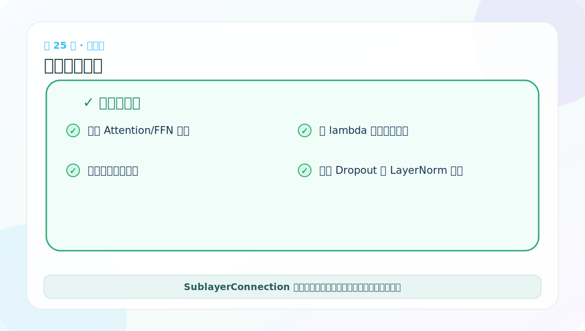
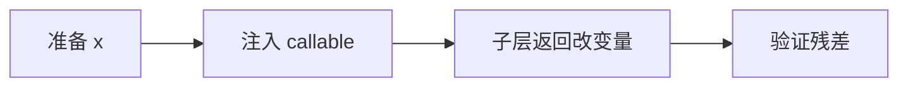

# 第 25 节：子层连接测试：用 lambda 注入不同组件

> 笔记编号 25/38 · 对应原视频 P130 · [打开这一集](https://www.bilibili.com/video/BV14mdfBDE4Q?p=130)

[← 上一节：24 SublayerConnection：残差、Dropout 与归一化](./24-sublayer-connection-code.md) · [返回总目录](./README.md) · [下一节：26 EncoderLayer 代码：两个子层串起来 →](./26-encoder-layer-code.md)

## 这节解决什么问题

Attention 需要 mask 等额外参数，而 FFN 只接收 x。用 lambda 把它们统一包装成“接收一个 x 的可调用对象”。



图要沿箭头或结构层级阅读。先说清楚数据从哪里来、形状怎样变化，再记组件名称。

## 老师原声整理稿（按讲解顺序）

### 0:00–3:55　测试要同时准备数据、外壳和内部函数

老师先创建 SublayerConnection(size=512,dropout=...)。完整调用还需要两样东西：

- x：待处理的 [B,L,D]；
- sublayer：接收一个张量并返回同形状结果的可调用对象。

这揭示了外壳设计：SublayerConnection 管“怎么包”，具体 Attention/FFN 管“里面算什么”。

### 3:55–7:53　用普通函数包装 Self-Attention

老师先定义一个函数：

```python
def sublayer(x):
    return self_attn(x, x, x, mask)
```

Self-Attention 的 Q=K=V 都使用传进来的 x。注意在 Pre-LN 外壳中，这个 x 已经是 `norm(original_x)`；若函数错误捕获外层旧变量，就会绕过 LayerNorm，shape 仍对但逻辑错误。

### 7:53–11:57　lambda 是同一件事的短写法

一行 lambda 可以替代上面的函数：

```python
lambda x: self_attn(x, x, x, mask)
```

lambda 适合这种只在调用处使用一次的简单包装，并能捕获 mask。交叉注意力还会捕获 memory，让 Query 使用 x、Key/Value 使用 memory。

老师现场让同学口述 lambda 写法，是为了练习“参数 x 来自外壳，其他依赖来自闭包”，而不是炫技。

### 11:57–15:58　同一外壳也能包 FFN

FFN 本来就只接收 x，因此可以直接传对象：

```python
connection(x, feed_forward)
```

也可以写 `lambda x: feed_forward(x)`，但没有额外参数时显得多余。注意创建 FFN 需要 d_model 与 d_ff；创建多头需要 h 与 d_model，不能把这些构造参数混在一起。

### 15:58–18:43　输出 shape 与更小的单元测试

老师打印最终 [2,4,512]，说明 norm、子层、dropout、残差整条路线接口一致。

还应使用两个确定性假子层单独验证外壳：

- `lambda x: torch.zeros_like(x)`，dropout=0 时输出必须等于原始 x；
- `lambda x: x`，可手算输出是否等于 original_x + norm(original_x)。

这些测试能把残差错误与注意力随机数分开。测试真实 Attention 时再检查 mask 和权重性质。

## 辅助流程图




## 完整原声逐段记录

[查看本节按时间戳整理的完整音轨转写](./transcripts/p130.md)

这份逐段记录用于核查老师讲过的内容是否遗漏；学习时优先阅读上面的校正文章，遇到想追溯的细节再按时间戳查看原声记录。

## 零基础先记住

- SublayerConnection 不关心内部是 Attention 还是 FFN
- lambda 闭包可以捕获 mask、memory 等额外参数
- 测试要检查残差形状和调用顺序

## 最小可运行代码

下面代码默认从项目根目录运行。涉及模型组件时，使用 [transformer_from_scratch](../../transformer_from_scratch/README.md) 中经过测试的 PyTorch 实现。

```python
import torch
from transformer_from_scratch.model import SublayerConnection
x = torch.ones(1, 2, 4)
layer = SublayerConnection(4, dropout=0.0)
y = layer(x, lambda normalized: torch.zeros_like(normalized))
print(torch.equal(x, y))
```

### 输入和输出怎么看

输出 True：当子层返回全零时，残差结果应精确等于原始 x。

## 最容易踩的坑

lambda 中若误用外层旧 x，而不是传入的 normalized x，会绕过 LayerNorm，让 Pre-LN 失效。

## 本节知识链

`准备 x → 注入 callable → 子层返回改变量 → 验证残差`

Transformer 学习的主线始终是形状。每经过一个箭头，都问自己：batch、序列长度、特征维、头数和词表维中的哪一个发生了变化？

## 自测

**问题：当子层输出全 0 且 dropout=0 时，残差输出是什么？**

<details>
<summary>点开核对答案</summary>

原始 x，因为 x+0=x。

</details>

## 学完检查

- [ ] 我能不用术语解释本节组件解决的问题
- [ ] 我能在运行前写出关键张量形状
- [ ] 我能指出 Q、K、V 或 mask 的来源
- [ ] 我知道代码“形状正确但逻辑可能错误”的情况
- [ ] 我能独立回答自测题

[← 上一节：24 SublayerConnection：残差、Dropout 与归一化](./24-sublayer-connection-code.md) · [返回总目录](./README.md) · [下一节：26 EncoderLayer 代码：两个子层串起来 →](./26-encoder-layer-code.md)
