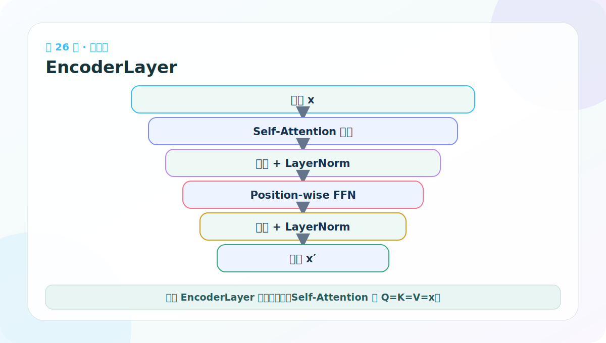
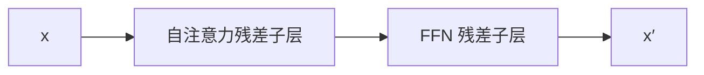
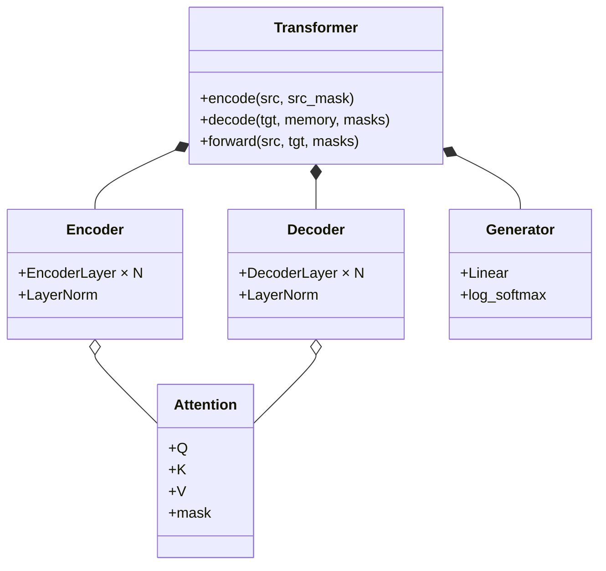

# 第 26 节：EncoderLayer 代码：两个子层串起来

> 笔记编号 26/38 · 对应原视频 P131 · [打开这一集](https://www.bilibili.com/video/BV14mdfBDE4Q?p=131)

[← 上一节：25 子层连接测试：用 lambda 注入不同组件](./25-sublayer-connection-test.md) · [返回总目录](./README.md) · [下一节：27 EncoderLayer 测试：看模块树，也看 mask →](./27-encoder-layer-test.md)

## 这节解决什么问题

一个 EncoderLayer 先做自注意力，再做位置前馈网络；两者分别由独立 SublayerConnection 包住。



图要沿箭头或结构层级阅读。先说清楚数据从哪里来、形状怎样变化，再记组件名称。

## 老师原声整理稿（按讲解顺序）

### 0:00–3:45　从组件进入 EncoderLayer

老师指出，现在已经有输入端、Attention、FFN、LayerNorm 和 SublayerConnection，可以开始搭一个完整编码器层。EncoderLayer 不是整个 Encoder；它是后面要重复 N 次的基本积木。

新模块导入前面各文件，体现依赖方向：EncoderLayer 使用基础组件，基础组件不依赖 EncoderLayer。

### 3:45–7:34　初始化保存两个核心组件和两个外壳

EncoderLayer 构造函数接收 d_model、self_attn、feed_forward、dropout。内部保存注意力和 FFN，并用：

```python
self.sublayer = clones(SublayerConnection(d_model, dropout), 2)
self.size = d_model
```

两个 SublayerConnection 必须是独立对象，分别拥有自己的 LayerNorm 参数。size 供上层 Encoder 创建最终 LayerNorm。

### 7:34–12:24　第一个子层：源侧 Self-Attention

前向接收 x 与 src_mask：

```python
x = self.sublayer[0](
    x,
    lambda x: self.self_attn(x, x, x, src_mask),
)
```

Pre-LN 外壳先归一化 x，再把同一张量作为 Q、K、V。src_mask 用于遮源侧 PAD；Encoder 通常没有因果限制，可以同时看左右文。

老师现场反复区分命名：类属性可以叫 self_attn，内部实现类型是 MultiHeadedAttention；“self”描述 Q/K/V 来源，不是另一个新注意力公式。

### 12:24–14:54　第二个子层：Position-wise FFN

第一个子层输出继续进入：

```python
x = self.sublayer[1](x, self.feed_forward)
return x
```

FFN 不需要 mask，也不需要 lambda 捕获额外参数，可以直接作为可调用对象传入。

一个 EncoderLayer 的完整数据流是：

> x → LN → Self-Attention → Dropout → 残差 → LN → FFN → Dropout → 残差。

两个子层都保持 [B,Ls,D]。交叉注意力不属于 EncoderLayer，因为它需要目标侧 Query；它只会出现在 DecoderLayer。

## 辅助流程图



### 组件层级图



## 完整原声逐段记录

[查看本节按时间戳整理的完整音轨转写](./transcripts/p131.md)

这份逐段记录用于核查老师讲过的内容是否遗漏；学习时优先阅读上面的校正文章，遇到想追溯的细节再按时间戳查看原声记录。

## 零基础先记住

- 自注意力调用 self_attn(x,x,x,mask)
- FFN 接收上一个子层输出
- 两个 SublayerConnection 必须是独立深拷贝

## 最小可运行代码

下面代码默认从项目根目录运行。涉及模型组件时，使用 [transformer_from_scratch](../../transformer_from_scratch/README.md) 中经过测试的 PyTorch 实现。

```python
import torch
from transformer_from_scratch.model import EncoderLayer, MultiHeadedAttention, PositionwiseFeedForward
layer = EncoderLayer(16, MultiHeadedAttention(4,16,0.0), PositionwiseFeedForward(16,32,0.0), 0.0)
x = torch.randn(2,5,16)
print(layer(x, None).shape)
```

### 输入和输出怎么看

输出仍为 [2,5,16]，所以多个 EncoderLayer 才能首尾相接。

## 最容易踩的坑

Encoder 自注意力的 Q/K/V 都是当前 x；若误传三份独立随机张量，就不是 Self-Attention。

## 本节知识链

`x → 自注意力残差子层 → FFN 残差子层 → x′`

Transformer 学习的主线始终是形状。每经过一个箭头，都问自己：batch、序列长度、特征维、头数和词表维中的哪一个发生了变化？

## 自测

**问题：EncoderLayer 为什么只有两个子层？**

<details>
<summary>点开核对答案</summary>

它包含 Self-Attention 和 FFN；交叉注意力只存在于 Encoder-Decoder 架构的 Decoder 中。

</details>

## 学完检查

- [ ] 我能不用术语解释本节组件解决的问题
- [ ] 我能在运行前写出关键张量形状
- [ ] 我能指出 Q、K、V 或 mask 的来源
- [ ] 我知道代码“形状正确但逻辑可能错误”的情况
- [ ] 我能独立回答自测题

[← 上一节：25 子层连接测试：用 lambda 注入不同组件](./25-sublayer-connection-test.md) · [返回总目录](./README.md) · [下一节：27 EncoderLayer 测试：看模块树，也看 mask →](./27-encoder-layer-test.md)
