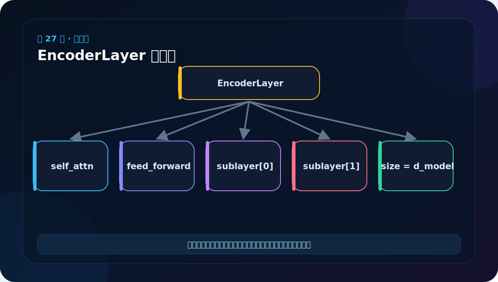

# 第 27 节：EncoderLayer 测试：看模块树，也看 mask

> 笔记编号 27/38 · 对应原视频 P132 · [打开这一集](https://www.bilibili.com/video/BV14mdfBDE4Q?p=132)

[← 上一节：26 EncoderLayer 代码：两个子层串起来](./26-encoder-layer-code.md) · [返回总目录](./README.md) · [下一节：28 Encoder 堆叠：N 层独立参数逐层提炼 →](./28-encoder-code-and-test.md)

## 这节解决什么问题

打印模块树能确认 self_attn、feed_forward 和两个残差包装都被注册；前向测试再确认 mask 能正确传入注意力。



图要沿箭头或结构层级阅读。先说清楚数据从哪里来、形状怎样变化，再记组件名称。

## 老师原声整理稿（按讲解顺序）

### 0:00–3:49　创建 EncoderLayer 需要四样东西

老师准备测试数据 x、源 mask、多头注意力对象和 FFN 对象，再创建：

```python
layer = EncoderLayer(
    d_model=512,
    self_attn=MultiHeadedAttention(8, 512),
    feed_forward=PositionwiseFeedForward(512, 2048),
    dropout=0.1,
)
```

构造参数很多时可把鼠标悬停看 IDE 签名，但最终仍要理解每个参数代表什么，不能只靠自动提示填数。

### 3:49–8:41　执行前向并检查大形状

输入 [2,4,512] 经一个 EncoderLayer 后仍为 [2,4,512]。老师只打印前几个 token、前几个特征，避免控制台被 4096 个数淹没。

切片输出时要明确方括号语义，例如 `out[0,:2,:5]` 是第一个句子、前两个 token、每个 token 前五个特征。

### 8:41–12:34　打印模块树检查组件是否注册

正确对象树应出现：

- self_attn，其中包含四个 Linear；
- feed_forward，其中包含两层 Linear；
- sublayer，其中有两个 SublayerConnection；
- 每个外壳内的 LayerNorm 与 Dropout。

打印模型不仅是看结构。只有赋为 Module 属性、ModuleList 等已注册容器的子层，参数才会进入 `model.parameters()`、优化器和 state_dict。普通 Python list 可能让参数悄悄缺失。

### 12:34–15:15　用类比重新对应两条子层路线

老师回到火锅“多头分格再汇总”与 FFN“先升维再降维”的类比。一个 EncoderLayer 正是把这两种处理用两个残差外壳串起来。

测试不能只看 shape。还应确认：

- 两个 SublayerConnection 不是同一对象；
- src_mask 会让 PAD 权重为 0；
- dropout=0/eval 时输出可复现；
- backward 后各注册参数能收到梯度。

这几项能发现“结构打印正常但逻辑共享/遮罩错误”的问题。

## 辅助流程图


## 完整原声逐段记录

[查看本节按时间戳整理的完整音轨转写](./transcripts/p132.md)

这份逐段记录用于核查老师讲过的内容是否遗漏；学习时优先阅读上面的校正文章，遇到想追溯的细节再按时间戳查看原声记录。

## 零基础先记住

- nn.ModuleList 才能正确注册重复子层参数
- 测试输出形状与输入一致
- 检查不同 mask 是否会改变注意力权重

## 最小可运行代码

下面代码默认从项目根目录运行。涉及模型组件时，使用 [transformer_from_scratch](../../transformer_from_scratch/README.md) 中经过测试的 PyTorch 实现。

```python
from transformer_from_scratch.model import EncoderLayer, MultiHeadedAttention, PositionwiseFeedForward
layer = EncoderLayer(8, MultiHeadedAttention(2,8,0.0), PositionwiseFeedForward(8,16,0.0), 0.0)
print(layer)
print("参数量：", sum(p.numel() for p in layer.parameters()))
```

### 输入和输出怎么看

模型树会列出注意力、FFN 和两个 SublayerConnection；参数量应大于 0。

## 最容易踩的坑

普通 Python list 中的层不会自动注册到 Module 参数树；重复网络层应使用 ModuleList。

## 本节知识链

`检查模块树 → 检查参数注册 → 执行前向 → 检查 mask 效果`

Transformer 学习的主线始终是形状。每经过一个箭头，都问自己：batch、序列长度、特征维、头数和词表维中的哪一个发生了变化？

## 自测

**问题：为什么只看输出形状不能发现所有错误？**

<details>
<summary>点开核对答案</summary>

即使 mask 未生效或两个层错误共享参数，形状仍可能完全正确。

</details>

## 学完检查

- [ ] 我能不用术语解释本节组件解决的问题
- [ ] 我能在运行前写出关键张量形状
- [ ] 我能指出 Q、K、V 或 mask 的来源
- [ ] 我知道代码“形状正确但逻辑可能错误”的情况
- [ ] 我能独立回答自测题

[← 上一节：26 EncoderLayer 代码：两个子层串起来](./26-encoder-layer-code.md) · [返回总目录](./README.md) · [下一节：28 Encoder 堆叠：N 层独立参数逐层提炼 →](./28-encoder-code-and-test.md)
