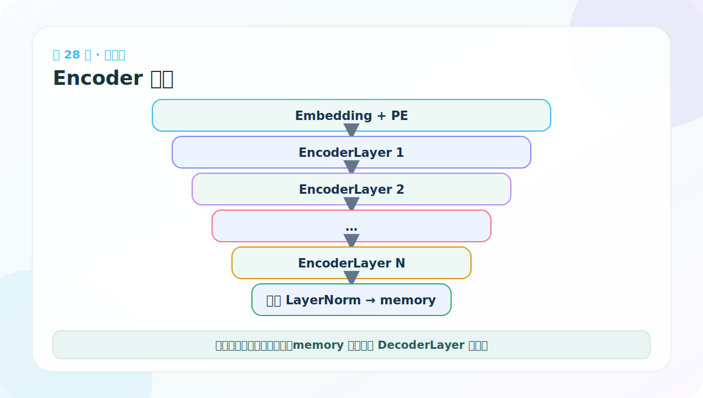
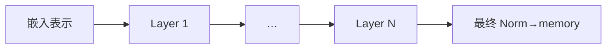

# 第 28 节：Encoder 堆叠：N 层独立参数逐层提炼

> 笔记编号 28/38 · 对应原视频 P133 · [打开这一集](https://www.bilibili.com/video/BV14mdfBDE4Q?p=133)

[← 上一节：27 EncoderLayer 测试：看模块树，也看 mask](./27-encoder-layer-test.md) · [返回总目录](./README.md) · [下一节：29 DecoderLayer 代码：三个子层与两种长度 →](./29-decoder-layer-code.md)

## 这节解决什么问题

Encoder 深拷贝同一个层结构 N 次，按顺序传递 x，最后再做一次 LayerNorm，输出供 Decoder 使用的 memory。



图要沿箭头或结构层级阅读。先说清楚数据从哪里来、形状怎样变化，再记组件名称。

## 老师原声整理稿（按讲解顺序）

### 0:00–3:53　Encoder 是“层的容器”

老师先回到架构：完整 Encoder 由 N 个 EncoderLayer 堆叠，原论文常用 N=6。它不重新实现 Attention，而是复用已经验证过的一层。

代码越往上越短，因为复杂度被封装在下层。读代码时要能在脑中展开：Encoder 的一行 layer(x,mask)，内部其实包含两次 LayerNorm、一次多头自注意力、一次 FFN、两条残差和 Dropout。

### 3:53–7:47　初始化克隆层并准备最终 LayerNorm

Encoder 构造函数接收 base layer 和 N：

```python
self.layers = clones(layer, N)
self.norm = LayerNorm(layer.size)
```

N 不写死为 6，方便构建小型测试模型或更深变体。BERT-base 等具体模型的层数也不等同于原始 Transformer 默认值，不能把“6”当作 Encoder 的定义。

### 7:47–10:47　逐层更新 x

前向：

```python
for layer in self.layers:
    x = layer(x, mask)
return self.norm(x)
```

第 1 层输出成为第 2 层输入，依次到第 N 层。各层共享同一份 src_mask 可见规则，但拥有独立参数。

堆叠中 shape 一直是 [B,Ls,D]；变化的是每个 token 已融合的上下文层次。最后 LayerNorm 产生 memory，供 Decoder 读取。

### 10:47–18:49　课堂创建基础层并克隆多层

老师先创建 MultiHeadedAttention 与 FFN，再组成 EncoderLayer，最后传入 Encoder(layer,N)。教学测试可令 N=3 减少输出，正式原论文配置常为 6。

最容易犯错的是 `[layer] * N`：它重复同一对象引用，使所有“层”共享参数。deepcopy 才得到结构相同、参数独立的多个层。

### 18:49–24:54　测试、返回值和 memory 的边界

输入 [2,4,512]，经过多层仍输出 [2,4,512]。老师打印前几个特征，并强调必须 return；Decoder 后面要接收这个结果。

Encoder 输出不是词表概率，也不是已经翻译出的句子。它是源句 memory。每个 DecoderLayer 的交叉注意力都会读取同一份 memory。

本节最后总结层级：

> 组件 → SublayerConnection → EncoderLayer（2 子层）→ Encoder（N 层）→ memory。

## 辅助流程图




## 完整原声逐段记录

[查看本节按时间戳整理的完整音轨转写](./transcripts/p133.md)

这份逐段记录用于核查老师讲过的内容是否遗漏；学习时优先阅读上面的校正文章，遇到想追溯的细节再按时间戳查看原声记录。

## 零基础先记住

- 层结构相同但参数对象独立
- 每层都使用同一份源 mask
- 最终 memory 形状仍为 [B,Ls,D]

## 最小可运行代码

下面代码默认从项目根目录运行。涉及模型组件时，使用 [transformer_from_scratch](../../transformer_from_scratch/README.md) 中经过测试的 PyTorch 实现。

```python
import torch
from transformer_from_scratch.model import Encoder, EncoderLayer, MultiHeadedAttention, PositionwiseFeedForward
base = EncoderLayer(8, MultiHeadedAttention(2,8,0.0), PositionwiseFeedForward(8,16,0.0), 0.0)
encoder = Encoder(base, n=3)
print(encoder(torch.randn(2,6,8), None).shape)
```

### 输入和输出怎么看

输出 [2,6,8]；层数增加改变的是计算深度，不改变对外形状。

## 最容易踩的坑

写 layers=[base]*N 会让每一层引用同一个对象、共享权重；需要 deepcopy。

## 本节知识链

`嵌入表示 → Layer 1 → … → Layer N → 最终 Norm→memory`

Transformer 学习的主线始终是形状。每经过一个箭头，都问自己：batch、序列长度、特征维、头数和词表维中的哪一个发生了变化？

## 自测

**问题：三个 EncoderLayer 是否读取三份不同源 mask？**

<details>
<summary>点开核对答案</summary>

通常读取同一份源 mask，因为 PAD 位置在所有层都相同。

</details>

## 学完检查

- [ ] 我能不用术语解释本节组件解决的问题
- [ ] 我能在运行前写出关键张量形状
- [ ] 我能指出 Q、K、V 或 mask 的来源
- [ ] 我知道代码“形状正确但逻辑可能错误”的情况
- [ ] 我能独立回答自测题

[← 上一节：27 EncoderLayer 测试：看模块树，也看 mask](./27-encoder-layer-test.md) · [返回总目录](./README.md) · [下一节：29 DecoderLayer 代码：三个子层与两种长度 →](./29-decoder-layer-code.md)
