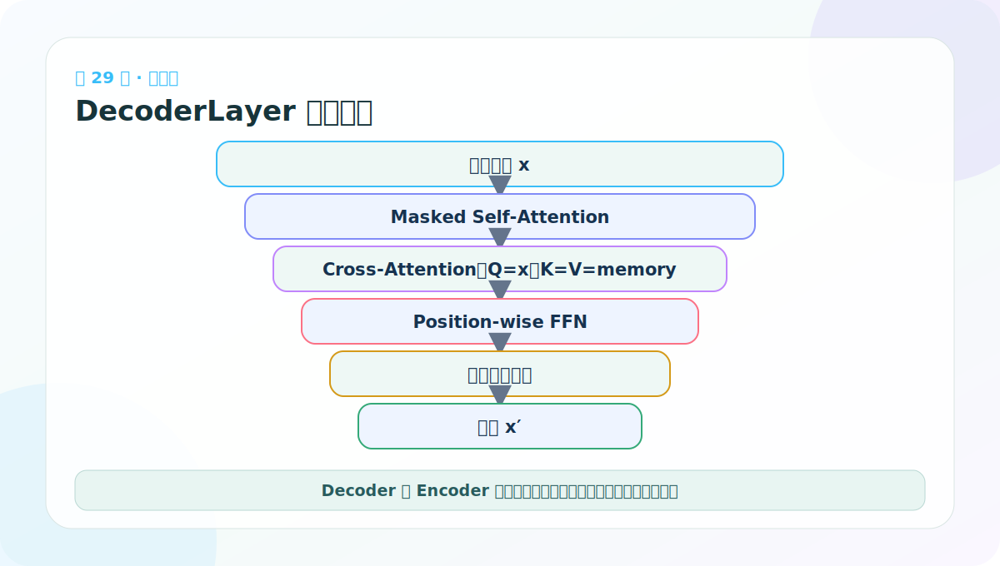
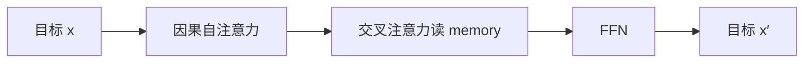
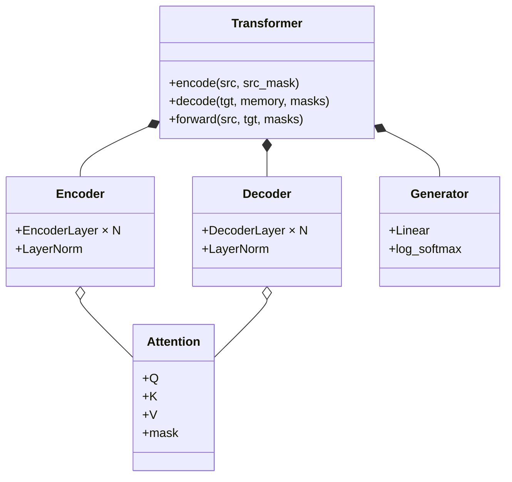

# 第 29 节：DecoderLayer 代码：三个子层与两种长度

> 笔记编号 29/38 · 对应原视频 P134 · [打开这一集](https://www.bilibili.com/video/BV14mdfBDE4Q?p=134)

[← 上一节：28 Encoder 堆叠：N 层独立参数逐层提炼](./28-encoder-code-and-test.md) · [返回总目录](./README.md) · [下一节：30 DecoderLayer 测试：故意让源长和目标长不同 →](./30-decoder-layer-test.md)

## 这节解决什么问题

DecoderLayer 按顺序执行带因果 mask 的目标自注意力、读取 memory 的交叉注意力，以及位置前馈网络。



图要沿箭头或结构层级阅读。先说清楚数据从哪里来、形状怎样变化，再记组件名称。

## 老师原声整理稿（按讲解顺序）

### 0:00–2:55　DecoderLayer 比 EncoderLayer 多一个注意力子层

老师说解码器代码更容易，是因为 clones、SublayerConnection、MultiHeadedAttention 与 FFN 都已经实现。DecoderLayer 只需按正确来源把它们连成三个子层：

1. 目标侧 masked self-attention；
2. 源—目标 cross-attention；
3. FFN。

### 2:55–7:45　初始化保存两套 Attention、一个 FFN、三个外壳

构造函数接收 d_model、self_attn、src_attn、feed_forward、dropout。self_attn 与 src_attn 结构相同但参数应独立，所以创建整层时通常对基础 attention 做 deepcopy。

```python
self.sublayer = clones(SublayerConnection(d_model, dropout), 3)
```

三个外壳也各有独立 LayerNorm 参数。

### 7:45–10:46　forward 的五个输入

DecoderLayer 前向接收：

- x：[B,Lt,D]，目标隐藏状态；
- memory：[B,Ls,D]，Encoder 输出；
- src_mask：源 PAD 可见性；
- tgt_mask：目标 PAD + 因果可见性。

课堂口述中 src/source、tgt/target 名称来回切换，代码里应固定命名，避免把两个 mask 传反。

### 10:46–12:54　第一子层：目标 Masked Self-Attention

```python
x = self.sublayer[0](
    x,
    lambda x: self.self_attn(x, x, x, tgt_mask),
)
```

Q=K=V 都来自目标 x，使用 tgt_mask 禁止读取未来与 PAD。权重最后两维是 Lt×Lt。

### 12:54–13:51　第二、三子层：Cross-Attention 与 FFN

交叉注意力：

```python
x = self.sublayer[1](
    x,
    lambda x: self.src_attn(x, memory, memory, src_mask),
)
```

Query 来自目标 x，Key/Value 来自源 memory，权重为 Lt×Ls。src_mask 遮源 PAD。输出位置由 Query 决定，因此仍是 [B,Lt,D]。

最后 `self.sublayer[2](x,self.feed_forward)` 做逐位置非线性加工。理解 DecoderLayer 时每到注意力就问：谁在提问、去哪里匹配、从哪里读值、用哪个 mask。

## 辅助流程图



### 组件层级图



## 完整原声逐段记录

[查看本节按时间戳整理的完整音轨转写](./transcripts/p134.md)

这份逐段记录用于核查老师讲过的内容是否遗漏；学习时优先阅读上面的校正文章，遇到想追溯的细节再按时间戳查看原声记录。

## 零基础先记住

- 自注意力：Q=K=V=x，使用 tgt_mask
- 交叉注意力：Q=x，K=V=memory，使用 src_mask
- 三个子层都用残差包装，输出长度始终是 Lt

## 最小可运行代码

下面代码默认从项目根目录运行。涉及模型组件时，使用 [transformer_from_scratch](../../transformer_from_scratch/README.md) 中经过测试的 PyTorch 实现。

```python
import torch
from transformer_from_scratch.model import DecoderLayer, MultiHeadedAttention, PositionwiseFeedForward
attn = MultiHeadedAttention(2,8,0.0)
layer = DecoderLayer(8, attn, MultiHeadedAttention(2,8,0.0), PositionwiseFeedForward(8,16,0.0), 0.0)
y = layer(torch.randn(2,4,8), torch.randn(2,6,8), None, None)
print(y.shape)
```

### 输入和输出怎么看

目标长度 4、源长度 6，输出仍为 [2,4,8]，因为 Query 来自目标侧。

## 最容易踩的坑

交叉注意力若把 Q/K/V 都传成 x，代码仍能跑，却完全读不到 Encoder memory。

## 本节知识链

`目标 x → 因果自注意力 → 交叉注意力读 memory → FFN → 目标 x′`

Transformer 学习的主线始终是形状。每经过一个箭头，都问自己：batch、序列长度、特征维、头数和词表维中的哪一个发生了变化？

## 自测

**问题：Cross-Attention 输出为什么是 Lt 长而不是 Ls 长？**

<details>
<summary>点开核对答案</summary>

输出每个位置对应一个 Query；Q 来自目标侧，所以长度是 Lt。

</details>

## 学完检查

- [ ] 我能不用术语解释本节组件解决的问题
- [ ] 我能在运行前写出关键张量形状
- [ ] 我能指出 Q、K、V 或 mask 的来源
- [ ] 我知道代码“形状正确但逻辑可能错误”的情况
- [ ] 我能独立回答自测题

[← 上一节：28 Encoder 堆叠：N 层独立参数逐层提炼](./28-encoder-code-and-test.md) · [返回总目录](./README.md) · [下一节：30 DecoderLayer 测试：故意让源长和目标长不同 →](./30-decoder-layer-test.md)
