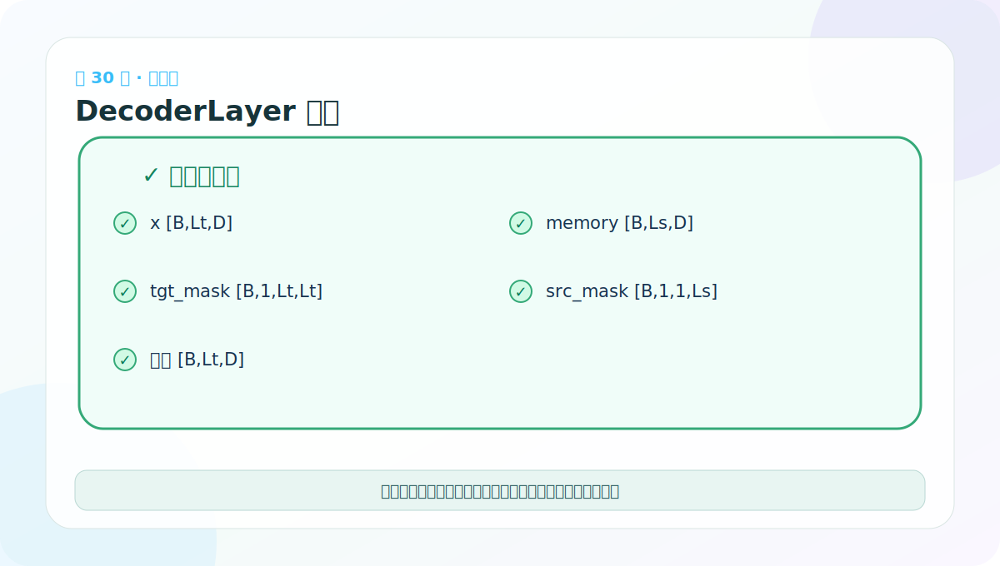
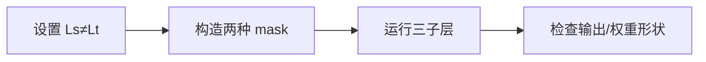

# 第 30 节：DecoderLayer 测试：故意让源长和目标长不同

> 笔记编号 30/38 · 对应原视频 P135 · [打开这一集](https://www.bilibili.com/video/BV14mdfBDE4Q?p=135)

[← 上一节：29 DecoderLayer 代码：三个子层与两种长度](./29-decoder-layer-code.md) · [返回总目录](./README.md) · [下一节：31 Decoder 堆叠：每层共享 memory，目标状态逐层变化 →](./31-decoder-code-and-test.md)

## 这节解决什么问题

若测试中 Ls=Lt，许多错误维度会被巧合掩盖。让源长 6、目标长 4，更容易发现 mask 或 Q/K/V 传错。



图要沿箭头或结构层级阅读。先说清楚数据从哪里来、形状怎样变化，再记组件名称。

## 老师原声整理稿（按讲解顺序）

### 0:00–4:28　目标输入仍复用 Embedding 与位置编码

老师创建目标词表与目标 token ID，再调用前面同一个输入模块得到 [B,Lt,D]。目标端不需要重新发明 Embedding/PE，只是词表参数和输入内容不同。

接着创建 tgt_mask。真实训练中它应组合“目标不是 PAD”与 subsequent_mask；课堂小测试可先用简单 mask，但必须知道最终两种限制都需要。

### 4:28–8:25　Self-Attention 与 Source-Attention 参数要独立

老师创建一个基础 MultiHeadedAttention，再用 deepcopy 得到 self_attn 和 src_attn。它们结构相同，却承担不同关系：

- self_attn 学目标内部依赖；
- src_attn 学目标到源的对齐。

若直接让两个属性指向同一对象，会错误共享 WQ/WK/WV/WO。

### 8:25–12:25　memory 来自 Encoder 测试结果

课堂复用上一节 Encoder 输出 [B,Ls,D] 作为 memory。随后准备 src_mask、FFN、DecoderLayer。构造参数顺序很多，老师通过 IDE 提示反复核对 d_model、self_attn、src_attn、feed_forward、dropout。

这里不要把“源序列 token ID”直接当 memory；必须先经过 src_embed 与 Encoder。

### 12:25–16:22　执行整层并追踪三种权重

DecoderLayer 输出形状应为 [B,Lt,D]。内部三条路线：

1. target self-attention：[B,h,Lt,Lt]；
2. cross-attention：[B,h,Lt,Ls]；
3. FFN：保持 [B,Lt,D]。

老师在模型树中指出三个 SublayerConnection，并确认最后 shape 不变。

### 16:22–18:15　测试最好让 Ls≠Lt

课堂示例源和目标可能都恰好长度 4，这会让错误 mask 侥幸通过。更强测试应故意设置 Ls=5、Lt=3：

- tgt_mask 最后两维必须 3×3；
- src_mask 的 Key 长度必须 5；
- cross-attention 权重必须 3×5；
- 输出目标长度仍为 3。

“破坏巧合相等”是调试张量程序的重要技巧。batch、词表大小、头数测试也应避免所有数字恰好相同。

## 辅助流程图




## 完整原声逐段记录

[查看本节按时间戳整理的完整音轨转写](./transcripts/p135.md)

这份逐段记录用于核查老师讲过的内容是否遗漏；学习时优先阅读上面的校正文章，遇到想追溯的细节再按时间戳查看原声记录。

## 零基础先记住

- x [B,Lt,D]，memory [B,Ls,D]
- tgt_mask 最后两维 Lt×Lt
- src_mask 的 Key 长度必须是 Ls，并能广播到 [B,h,Lt,Ls]

## 最小可运行代码

下面代码默认从项目根目录运行。涉及模型组件时，使用 [transformer_from_scratch](../../transformer_from_scratch/README.md) 中经过测试的 PyTorch 实现。

```python
import torch
from transformer_from_scratch.model import subsequent_mask
B, Ls, Lt = 2, 6, 4
src_mask = torch.ones(B, 1, 1, Ls, dtype=torch.bool)
tgt_mask = subsequent_mask(Lt)
print(src_mask.shape, tgt_mask.shape)
```

### 输入和输出怎么看

源 mask 为 [2,1,1,6]，目标 mask 为 [1,4,4]；它们服务于不同注意力。

## 最容易踩的坑

把 tgt_mask 错传给 cross-attention，在 Ls=Lt 时可能不报错；长度不同后会立即暴露。

## 本节知识链

`设置 Ls≠Lt → 构造两种 mask → 运行三子层 → 检查输出/权重形状`

Transformer 学习的主线始终是形状。每经过一个箭头，都问自己：batch、序列长度、特征维、头数和词表维中的哪一个发生了变化？

## 自测

**问题：Decoder 自注意力分数最后两维是什么？交叉注意力呢？**

<details>
<summary>点开核对答案</summary>

自注意力是 [Lt,Lt]；交叉注意力是 [Lt,Ls]。

</details>

## 学完检查

- [ ] 我能不用术语解释本节组件解决的问题
- [ ] 我能在运行前写出关键张量形状
- [ ] 我能指出 Q、K、V 或 mask 的来源
- [ ] 我知道代码“形状正确但逻辑可能错误”的情况
- [ ] 我能独立回答自测题

[← 上一节：29 DecoderLayer 代码：三个子层与两种长度](./29-decoder-layer-code.md) · [返回总目录](./README.md) · [下一节：31 Decoder 堆叠：每层共享 memory，目标状态逐层变化 →](./31-decoder-code-and-test.md)
