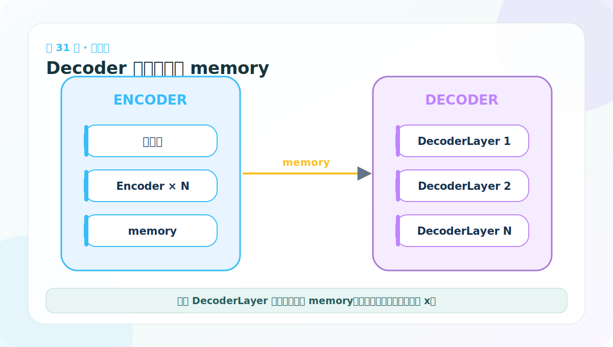
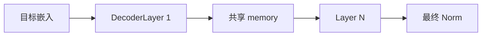

# 第 31 节：Decoder 堆叠：每层共享 memory，目标状态逐层变化

> 笔记编号 31/38 · 对应原视频 P136 · [打开这一集](https://www.bilibili.com/video/BV14mdfBDE4Q?p=136)

[← 上一节：30 DecoderLayer 测试：故意让源长和目标长不同](./30-decoder-layer-test.md) · [返回总目录](./README.md) · [下一节：32 Generator 代码：从隐藏维映射到目标词表 →](./32-generator-code.md)

## 这节解决什么问题

Decoder 把基础 DecoderLayer 深拷贝 N 份。每一层都接收上一层目标状态，但读取同一份 Encoder memory。



图要沿箭头或结构层级阅读。先说清楚数据从哪里来、形状怎样变化，再记组件名称。

## 老师原声整理稿（按讲解顺序）

### 0:00–4:53　Decoder 与 Encoder 的容器写法几乎相同

完整 Decoder 把基础 DecoderLayer 深拷贝 N 次，再准备最终 LayerNorm：

```python
self.layers = clones(layer, N)
self.norm = LayerNorm(layer.size)
```

原论文常用 N=6，但构造参数不写死。代码之所以短，是因为每层三个子层已经封装完成。

### 4:53–8:36　前向让同一份 memory 进入每一层

```python
for layer in self.layers:
    x = layer(x, memory, src_mask, tgt_mask)
return self.norm(x)
```

x 是不断更新的目标隐藏状态；memory 是 Encoder 输出，所有 DecoderLayer 都能读取同一份源上下文。memory 不因 Decoder 加工而被改写，但不同层的 Cross-Attention 参数独立。

### 8:36–14:17　搭建测试对象并检查 [B,Lt,D]

老师复用 DecoderLayer 测试中已经创建的 self_attn、src_attn、FFN、x、memory 与两种 mask，再创建多层 Decoder。

每层输入输出保持 [2,4,512]，完整 Decoder 最终也保持这个 shape。最后输出不是词概率，只是目标侧上下文隐藏表示，仍需 Generator 把 D 映射到目标词表。

课堂从复制测试代码时出现函数名/变量名未改全的风险，提醒我们复制粘贴后应逐项核对：测试的是 DecoderLayer 还是 Decoder、调用对象和打印标签是否一致。

### 14:17–20:47　三种注意力在整图中对应哪里

老师回到架构图逐一对应：

- Encoder 每层的注意力：源侧 Self-Attention；
- Decoder 每层下方：Masked Target Self-Attention；
- Decoder 每层中间：Source–Target Cross-Attention。

前两者 Q、K、V 都来自同一侧，所以叫 self；交叉注意力的 Q 来自目标，K/V 来自 memory。

### 20:47–28:12　为什么所有 DecoderLayer 都读 Encoder 输出

老师用 7 个英语词翻译为 9 个法语词举例。生成法语第 3 个位置时，Decoder 要判断七个源词中哪些与当前目标最相关；Cross-Attention 权重因此是 Lt×Ls。

每一层都可在自己当前的抽象层次重新对齐源句，而不是只有第一层读一次 memory 后永久丢掉。完整主线：

> 目标前缀逐层更新；每层先看目标过去，再查询同一源 memory，再做 FFN；最终仍保留目标长度。

## 辅助流程图




## 完整原声逐段记录

[查看本节按时间戳整理的完整音轨转写](./transcripts/p136.md)

这份逐段记录用于核查老师讲过的内容是否遗漏；学习时优先阅读上面的校正文章，遇到想追溯的细节再按时间戳查看原声记录。

## 零基础先记住

- memory 在 Decoder 层间不被改写
- src_mask 与 tgt_mask 每层重复使用
- 最后 LayerNorm 后输出 [B,Lt,D]

## 最小可运行代码

下面代码默认从项目根目录运行。涉及模型组件时，使用 [transformer_from_scratch](../../transformer_from_scratch/README.md) 中经过测试的 PyTorch 实现。

```python
import torch
from transformer_from_scratch.model import Decoder, DecoderLayer, MultiHeadedAttention, PositionwiseFeedForward
base = DecoderLayer(8, MultiHeadedAttention(2,8,0.0), MultiHeadedAttention(2,8,0.0), PositionwiseFeedForward(8,16,0.0), 0.0)
decoder = Decoder(base, 2)
print(decoder(torch.randn(2,4,8), torch.randn(2,6,8), None, None).shape)
```

### 输入和输出怎么看

输出 [2,4,8]。两层都能访问 [2,6,8] 的同一份 memory。

## 最容易踩的坑

共享 memory 不等于各层交叉注意力共享参数；层是深拷贝的，参数应独立。

## 本节知识链

`目标嵌入 → DecoderLayer 1 → 共享 memory → Layer N → 最终 Norm`

Transformer 学习的主线始终是形状。每经过一个箭头，都问自己：batch、序列长度、特征维、头数和词表维中的哪一个发生了变化？

## 自测

**问题：DecoderLayer 之间变化的主要张量是什么？**

<details>
<summary>点开核对答案</summary>

目标侧隐藏状态 x；Encoder memory 通常保持不变供每层读取。

</details>

## 学完检查

- [ ] 我能不用术语解释本节组件解决的问题
- [ ] 我能在运行前写出关键张量形状
- [ ] 我能指出 Q、K、V 或 mask 的来源
- [ ] 我知道代码“形状正确但逻辑可能错误”的情况
- [ ] 我能独立回答自测题

[← 上一节：30 DecoderLayer 测试：故意让源长和目标长不同](./30-decoder-layer-test.md) · [返回总目录](./README.md) · [下一节：32 Generator 代码：从隐藏维映射到目标词表 →](./32-generator-code.md)
