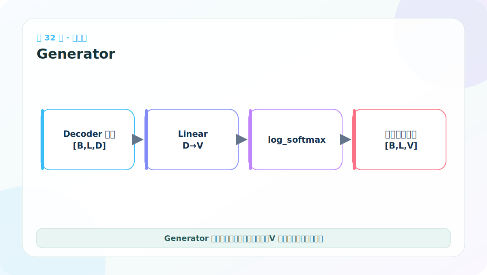
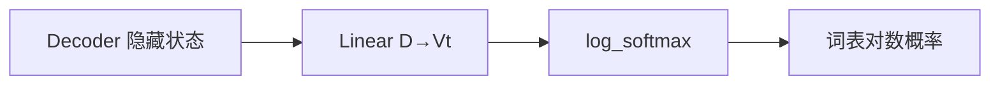

# 第 32 节：Generator 代码：从隐藏维映射到目标词表

> 笔记编号 32/38 · 对应原视频 P137 · [打开这一集](https://www.bilibili.com/video/BV14mdfBDE4Q?p=137)

[← 上一节：31 Decoder 堆叠：每层共享 memory，目标状态逐层变化](./31-decoder-code-and-test.md) · [返回总目录](./README.md) · [下一节：33 Generator 测试：指数还原后概率和应为 1 →](./33-generator-test.md)

## 这节解决什么问题

Decoder 每个位置只输出 D 维隐藏状态。Generator 用 Linear(D,Vt) 为目标词表中每个词生成一个分数，再转成对数概率。



图要沿箭头或结构层级阅读。先说清楚数据从哪里来、形状怎样变化，再记组件名称。

## 老师原声整理稿（按讲解顺序）

### 0:00–3:51　Decoder 输出还不是“词”

老师从 [2,4,512] 解释 Generator 的任务：两个句子、每个目标句四个位置、每个位置是一条 512 维隐藏向量。模型还不知道该选词表中的哪个 token。

若目标词表有 1000 个 token，每个位置都要产生 1000 个候选分数，所以形状应变为 [2,4,1000]。

### 3:51–6:46　Generator 只需一个 Linear

类初始化接收 d_model 与 vocab：

```python
self.proj = nn.Linear(d_model, vocab)
```

Linear 独立处理每个 B、L 位置，把最后一维 512 映射到 1000。若源、目标词表不同，这里的 vocab 必须是目标词表大小。

### 6:46–9:44　为什么使用 log_softmax

前向：

```python
return F.log_softmax(self.proj(x), dim=-1)
```

Linear 输出 logits，不是概率；log_softmax 沿最后的词表维归一化并返回对数概率。对数空间计算数值更稳定，也可直接与 NLLLoss 配合。

`log_probs.exp()` 才是普通概率，其最后一维和应为 1。不能说“对数概率本身相加等于 1”。

### 9:44–10:40　模块导入与职责边界

老师讨论把多个组件集中 re-export，减少后续导包长度。无论文件如何组织，Generator 的职责都应保持单一：

> 隐藏状态 D → 目标词表分布 Vt。

它不直接返回 token ID，也不完成贪心、采样或 beam search。训练时它提供所有位置分布；真实推理时解码算法会根据最后一个位置分布选下一个 token，再把新前缀送回 Decoder。

## 辅助流程图




## 完整原声逐段记录

[查看本节按时间戳整理的完整音轨转写](./transcripts/p137.md)

这份逐段记录用于核查老师讲过的内容是否遗漏；学习时优先阅读上面的校正文章，遇到想追溯的细节再按时间戳查看原声记录。

## 零基础先记住

- 输入 [B,Lt,D]，输出 [B,Lt,Vt]
- Vt 是目标词表大小，不一定等于源词表
- log_softmax 数值稳定，常与 NLLLoss 配合

## 最小可运行代码

下面代码默认从项目根目录运行。涉及模型组件时，使用 [transformer_from_scratch](../../transformer_from_scratch/README.md) 中经过测试的 PyTorch 实现。

```python
import torch
from transformer_from_scratch.model import Generator
layer = Generator(d_model=16, vocab_size=30)
x = torch.randn(2,5,16)
y = layer(x)
print(y.shape)
```

### 输入和输出怎么看

输出 [2,5,30]：每个样本、每个目标位置都有 30 个词的对数概率。

## 最容易踩的坑

Generator 输出不是词 ID。推理时还要根据概率选择 token，训练时则与正确目标计算损失。

## 本节知识链

`Decoder 隐藏状态 → Linear D→Vt → log_softmax → 词表对数概率`

Transformer 学习的主线始终是形状。每经过一个箭头，都问自己：batch、序列长度、特征维、头数和词表维中的哪一个发生了变化？

## 自测

**问题：为什么 Generator 的词表大小用 tgt_vocab？**

<details>
<summary>点开核对答案</summary>

它预测的是目标语言/目标序列中的词，两侧词表可能完全不同。

</details>

## 学完检查

- [ ] 我能不用术语解释本节组件解决的问题
- [ ] 我能在运行前写出关键张量形状
- [ ] 我能指出 Q、K、V 或 mask 的来源
- [ ] 我知道代码“形状正确但逻辑可能错误”的情况
- [ ] 我能独立回答自测题

[← 上一节：31 Decoder 堆叠：每层共享 memory，目标状态逐层变化](./31-decoder-code-and-test.md) · [返回总目录](./README.md) · [下一节：33 Generator 测试：指数还原后概率和应为 1 →](./33-generator-test.md)
