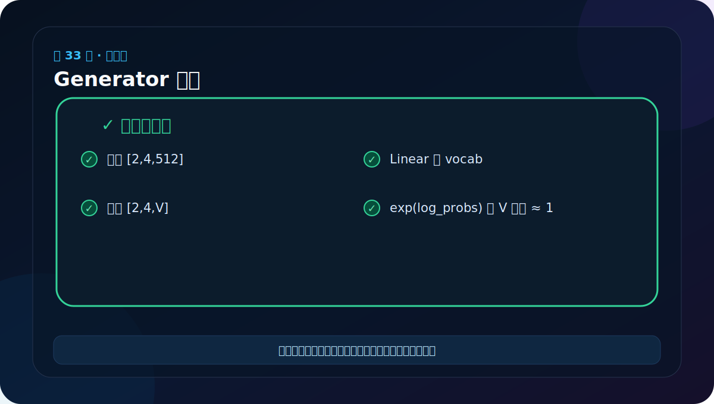
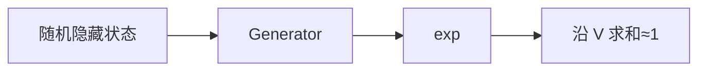

# 第 33 节：Generator 测试：指数还原后概率和应为 1

> 笔记编号 33/38 · 对应原视频 P138 · [打开这一集](https://www.bilibili.com/video/BV14mdfBDE4Q?p=138)

[← 上一节：32 Generator 代码：从隐藏维映射到目标词表](./32-generator-code.md) · [返回总目录](./README.md) · [下一节：34 完整模型上：forward 如何组织编码和解码 →](./34-full-transformer-upper.md)

## 这节解决什么问题

除了检查最后一维等于词表大小，还要把 log_probs 取 exp，验证每个位置沿词表维求和约为 1。



图要沿箭头或结构层级阅读。先说清楚数据从哪里来、形状怎样变化，再记组件名称。

## 老师原声整理稿（按讲解顺序）

### 0:00–3:55　先保证 Decoder 测试函数真的 return

老师复用上一节 Decoder 输出，现场提醒：测试辅助函数若只 print 不 return，Generator 就会收到 None。把输出显式 return 后，才能连接下一组件。

随后创建 Generator(d_model=512,vocab=1000)，把 [2,4,512] 传入。

### 3:55–6:42　第一项检查：shape 是 [2,4,1000]

输出每个位置有 1000 个候选，因此 shape 为 [2,4,1000]。老师再次用“两个句子、每句四个位置、每位置 1000 个词概率”解释三维。

打印完整张量会非常长，可只查看 `out[0,0,:10]` 与 shape。

### 6:42–10:58　第二项检查：把对数概率还原

老师选第一个样本的第一个词位置 `out[0,0]`，得到 1000 个 log probability。调用 `.exp()` 还原普通概率，再求和：

```python
probs = log_probs.exp()
total = probs[0, 0].sum()
```

total 应接近 1。若直接对 log_probs 求和，没有概率意义。

### 10:58–12:43　浮点结果要用近似比较

控制台可能显示 1.0000，也可能内部为 0.9999999。测试应：

```python
assert torch.allclose(
    probs.sum(-1),
    torch.ones_like(probs.sum(-1)),
    atol=1e-6,
)
```

这还能发现 softmax 维度写错：沿序列维归一化时 shape 仍正确，但每个位置的词表概率和不为 1。

### 12:43–18:45　把完整组件链再口述一遍

老师回到图中从 [B,L] token ID 开始：

> Embedding+PE → Encoder/Decoder 得 [B,Lt,D] → Linear 得 [B,Lt,Vt] → log_softmax 得词表对数概率。

真正选词可取最大概率，但训练通常同时计算所有目标位置的损失。Generator 测试跑通说明输出头正确，不代表整模已经学会翻译；还没有训练数据、loss、优化器和自回归生成循环。

## 辅助流程图




## 完整原声逐段记录

[查看本节按时间戳整理的完整音轨转写](./transcripts/p138.md)

这份逐段记录用于核查老师讲过的内容是否遗漏；学习时优先阅读上面的校正文章，遇到想追溯的细节再按时间戳查看原声记录。

## 零基础先记住

- log_probs.exp() 还原普通概率
- softmax 归一化轴必须是最后的词表维
- 使用 allclose 处理浮点误差

## 最小可运行代码

下面代码默认从项目根目录运行。涉及模型组件时，使用 [transformer_from_scratch](../../transformer_from_scratch/README.md) 中经过测试的 PyTorch 实现。

```python
import torch
from transformer_from_scratch.model import Generator
y = Generator(8, 11)(torch.randn(2,4,8))
print(y.shape)
print(torch.allclose(y.exp().sum(-1), torch.ones(2,4), atol=1e-6))
```

### 输入和输出怎么看

形状 [2,4,11]，概率和检查通常为 True。

## 最容易踩的坑

若误在长度维做 softmax，每个位置的词表概率不会归一化，但输出形状仍完全正确。

## 本节知识链

`随机隐藏状态 → Generator → exp → 沿 V 求和≈1`

Transformer 学习的主线始终是形状。每经过一个箭头，都问自己：batch、序列长度、特征维、头数和词表维中的哪一个发生了变化？

## 自测

**问题：为什么 log_probs 本身求和不等于 1？**

<details>
<summary>点开核对答案</summary>

它们是概率的对数；需要先 exp 还原概率再求和。

</details>

## 学完检查

- [ ] 我能不用术语解释本节组件解决的问题
- [ ] 我能在运行前写出关键张量形状
- [ ] 我能指出 Q、K、V 或 mask 的来源
- [ ] 我知道代码“形状正确但逻辑可能错误”的情况
- [ ] 我能独立回答自测题

[← 上一节：32 Generator 代码：从隐藏维映射到目标词表](./32-generator-code.md) · [返回总目录](./README.md) · [下一节：34 完整模型上：forward 如何组织编码和解码 →](./34-full-transformer-upper.md)
