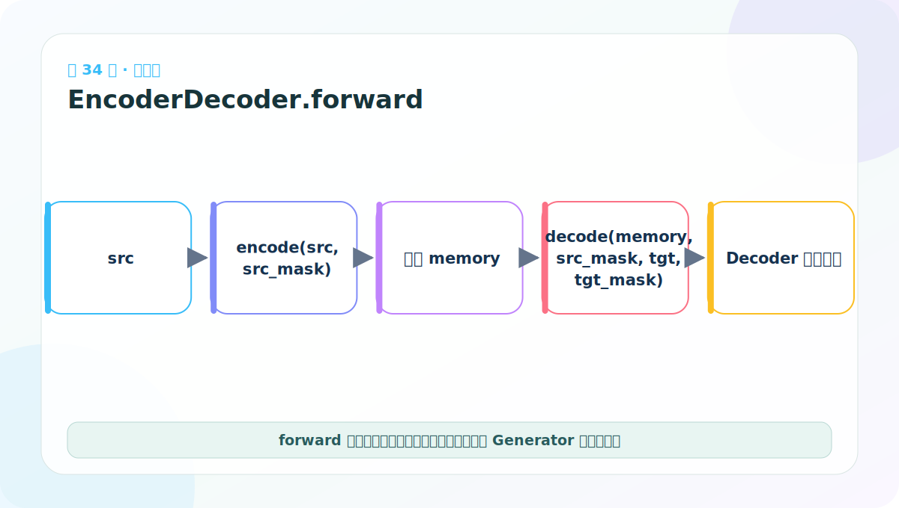
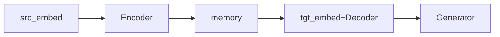
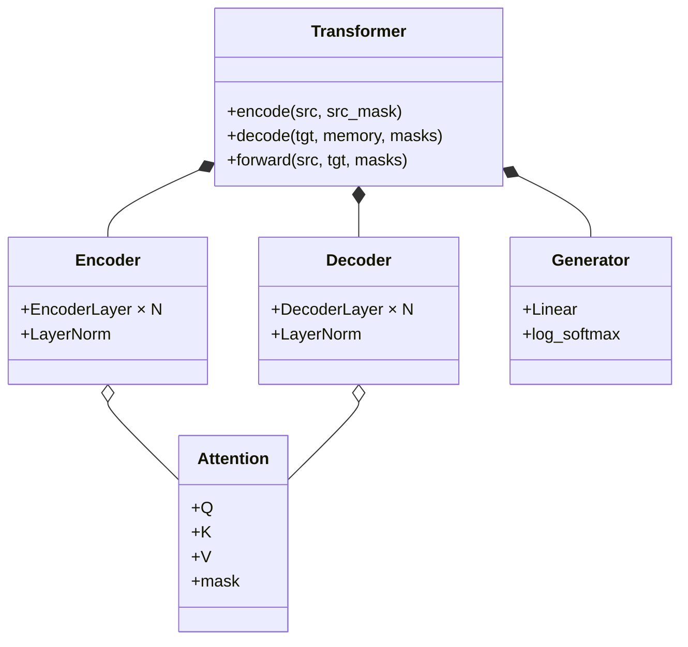

# 第 34 节：完整模型上：forward 如何组织编码和解码

> 笔记编号 34/38 · 对应原视频 P139 · [打开这一集](https://www.bilibili.com/video/BV14mdfBDE4Q?p=139)

[← 上一节：33 Generator 测试：指数还原后概率和应为 1](./33-generator-test.md) · [返回总目录](./README.md) · [下一节：35 完整模型下：encode/decode 接口要分清 →](./35-full-transformer-lower.md)

## 这节解决什么问题

完整 forward 先 encode(src) 得到 memory，再 decode(tgt,memory)，最后交给 Generator 得到词表对数概率。



图要沿箭头或结构层级阅读。先说清楚数据从哪里来、形状怎样变化，再记组件名称。

## 老师原声整理稿（按讲解顺序）

### 0:00–2:55　所有零件完成后，整体类只负责连接

老师确认输入、Encoder、Decoder 与 Generator 都已实现，开始定义 EncoderDecoder 顶层类。它对应机器翻译 Seq2Seq 架构：源序列经编码，目标前缀结合源 memory 解码，再映射到目标词表。

### 2:55–7:46　构造函数保存五个顶层模块

顶层对象接收：

- encoder；
- decoder；
- src_embed；
- tgt_embed；
- generator。

Embedding 要分源侧和目标侧，因为两个词表可能大小不同。Generator 使用目标 vocab。

### 7:46–12:49　forward 的输入与两种 mask

完整前向通常接收 src、tgt、src_mask、tgt_mask。课堂还提到 padding mask：PAD 只是补齐长度，不应被模型当成有语义词。

src_mask 会用于 Encoder 自注意力和 Decoder Cross-Attention；tgt_mask 会用于 Decoder 目标自注意力，组合 PAD 与未来遮盖。

### 12:49–15:53　主数据流

逻辑可写为：

```python
memory = self.encode(src, src_mask)
hidden = self.decode(memory, src_mask, tgt, tgt_mask)
return self.generator(hidden)
```

课堂累计实现有时让 forward 只返回 Decoder hidden，再由训练代码单独调用 generator；两种 API 都可以，但项目内部必须一致。配套实现选择明确返回词表 log_probs，避免“顶层 forward 是否含 Generator”含糊。

### 15:53–18:05　为什么还要拆 encode 与 decode

encode 封装 src_embed→encoder；decode 封装 tgt_embed→decoder。拆开后，推理时源句只编码一次，随后每生成一个新 token 反复 decode，不必重复计算 memory。

读名称时区分：

- encoder/decoder：nn.Module 组件；
- encode/decode：调用这些组件的方法。

顶层组装的意义不是加入新数学公式，而是把数据与 mask 按正确顺序送到已验证组件。

## 辅助流程图



### 组件层级图



## 完整原声逐段记录

[查看本节按时间戳整理的完整音轨转写](./transcripts/p139.md)

这份逐段记录用于核查老师讲过的内容是否遗漏；学习时优先阅读上面的校正文章，遇到想追溯的细节再按时间戳查看原声记录。

## 零基础先记住

- src_embed 与 tgt_embed 独立处理两侧词 ID
- Encoder 只运行一次，memory 供 Decoder 使用
- 项目 forward 直接返回 Generator 结果

## 最小可运行代码

下面代码默认从项目根目录运行。涉及模型组件时，使用 [transformer_from_scratch](../../transformer_from_scratch/README.md) 中经过测试的 PyTorch 实现。

```python
flow = ["src", "src_embed", "encoder -> memory",
        "tgt + memory -> decoder", "generator -> log_probs"]
print("\n".join(f"{i+1}. {x}" for i, x in enumerate(flow)))
```

### 输入和输出怎么看

打印整模五步。调试时应在每一步打印 shape，而不是只看最终异常。

## 最容易踩的坑

encode 是封装方法，encoder 是模块对象；命名混淆会导致错误递归或参数传递。

## 本节知识链

`src_embed → Encoder → memory → tgt_embed+Decoder → Generator`

Transformer 学习的主线始终是形状。每经过一个箭头，都问自己：batch、序列长度、特征维、头数和词表维中的哪一个发生了变化？

## 自测

**问题：为什么训练一个 batch 时 Encoder memory 不需要为每个目标位置重新计算？**

<details>
<summary>点开核对答案</summary>

同一源句的编码结果不变，可以由整段目标序列共同查询。

</details>

## 学完检查

- [ ] 我能不用术语解释本节组件解决的问题
- [ ] 我能在运行前写出关键张量形状
- [ ] 我能指出 Q、K、V 或 mask 的来源
- [ ] 我知道代码“形状正确但逻辑可能错误”的情况
- [ ] 我能独立回答自测题

[← 上一节：33 Generator 测试：指数还原后概率和应为 1](./33-generator-test.md) · [返回总目录](./README.md) · [下一节：35 完整模型下：encode/decode 接口要分清 →](./35-full-transformer-lower.md)
