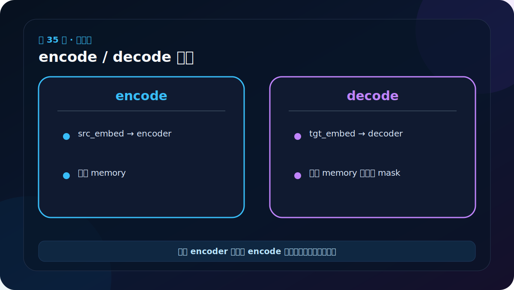
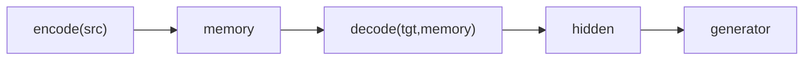
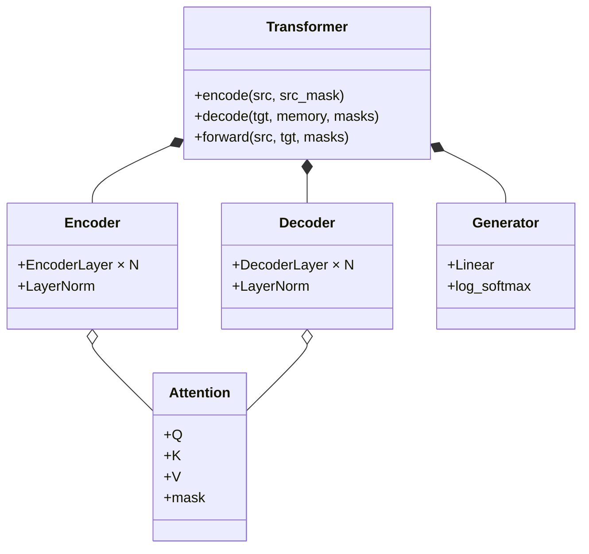

# 第 35 节：完整模型下：encode/decode 接口要分清

> 笔记编号 35/38 · 对应原视频 P140 · [打开这一集](https://www.bilibili.com/video/BV14mdfBDE4Q?p=140)

[← 上一节：34 完整模型上：forward 如何组织编码和解码](./34-full-transformer-upper.md) · [返回总目录](./README.md) · [下一节：36 完整模型组装：make_model 把所有组件接起来 →](./36-transformer-test-upper.md)

## 这节解决什么问题

encode 只接收源 ID 和源 mask；decode 接收目标 ID、memory、源 mask 和目标 mask。清晰接口能避免调用时参数顺序混乱。



图要沿箭头或结构层级阅读。先说清楚数据从哪里来、形状怎样变化，再记组件名称。

## 老师原声整理稿（按讲解顺序）

### 0:00–3:52　encode：源 ID 变成 memory

老师把 Encoder 路线单独实现：

```python
def encode(self, src, src_mask):
    return self.encoder(self.src_embed(src), src_mask)
```

src=[B,Ls]，src_embed 先变 [B,Ls,D]，Encoder 多层处理后仍是 [B,Ls,D]，这就是 memory。

src_mask 主要遮源 PAD。它不是为了防止源词看未来；普通 Encoder 通常双向读取完整非 PAD 源句。

### 3:52–7:40　decode：目标前缀查询 memory

```python
def decode(self, memory, src_mask, tgt, tgt_mask):
    return self.decoder(
        self.tgt_embed(tgt),
        memory,
        src_mask,
        tgt_mask,
    )
```

tgt=[B,Lt] 经目标输入端变 [B,Lt,D]；Decoder 输出仍保留 Lt。

src_mask 进入 Cross-Attention，控制可读源位置；tgt_mask 进入 Target Self-Attention，控制 PAD 与未来位置。

### 7:40–8:42　每个长度在哪保留

分开接口后，形状路线清楚：

```text
src [B,Ls] → memory [B,Ls,D]
tgt [B,Lt] + memory → hidden [B,Lt,D]
hidden → Generator → log_probs [B,Lt,Vt]
```

Cross-Attention 是唯一同时接触 Lt 和 Ls 的核心位置，权重 [B,h,Lt,Ls]。Generator 只替换最后一维 D→Vt，不改变 Lt。

这两个方法也为自回归推理做准备：memory 缓存一次，tgt 前缀逐步增长，每步只重复目标侧 decode 与 Generator。

## 辅助流程图



### 组件层级图



## 完整原声逐段记录

[查看本节按时间戳整理的完整音轨转写](./transcripts/p140.md)

这份逐段记录用于核查老师讲过的内容是否遗漏；学习时优先阅读上面的校正文章，遇到想追溯的细节再按时间戳查看原声记录。

## 零基础先记住

- encode 输出 [B,Ls,D] memory
- decode 输出 [B,Lt,D] 隐藏状态
- Generator 再把隐藏状态变成 [B,Lt,Vt]

## 最小可运行代码

下面代码默认从项目根目录运行。涉及模型组件时，使用 [transformer_from_scratch](../../transformer_from_scratch/README.md) 中经过测试的 PyTorch 实现。

```python
import torch
from transformer_from_scratch.model import make_model, subsequent_mask
model = make_model(20, 25, n=1, d_model=8, d_ff=16, h=2, dropout=0.0)
src, tgt = torch.randint(0,20,(2,6)), torch.randint(0,25,(2,4))
memory = model.encode(src, None)
hidden = model.decode(tgt, memory, None, subsequent_mask(4))
print(memory.shape, hidden.shape)
```

### 输入和输出怎么看

memory 为 [2,6,8]，hidden 为 [2,4,8]，清楚展示源长和目标长各自保留在哪里。

## 最容易踩的坑

源 ID 必须小于 src_vocab，目标 ID 必须小于 tgt_vocab，不能用同一随机上界偷懒。

## 本节知识链

`encode(src) → memory → decode(tgt,memory) → hidden → generator`

Transformer 学习的主线始终是形状。每经过一个箭头，都问自己：batch、序列长度、特征维、头数和词表维中的哪一个发生了变化？

## 自测

**问题：decode 为什么同时需要 src_mask 和 tgt_mask？**

<details>
<summary>点开核对答案</summary>

src_mask 用于交叉注意力屏蔽源 PAD；tgt_mask 用于目标自注意力屏蔽 PAD 和未来。

</details>

## 学完检查

- [ ] 我能不用术语解释本节组件解决的问题
- [ ] 我能在运行前写出关键张量形状
- [ ] 我能指出 Q、K、V 或 mask 的来源
- [ ] 我知道代码“形状正确但逻辑可能错误”的情况
- [ ] 我能独立回答自测题

[← 上一节：34 完整模型上：forward 如何组织编码和解码](./34-full-transformer-upper.md) · [返回总目录](./README.md) · [下一节：36 完整模型组装：make_model 把所有组件接起来 →](./36-transformer-test-upper.md)
