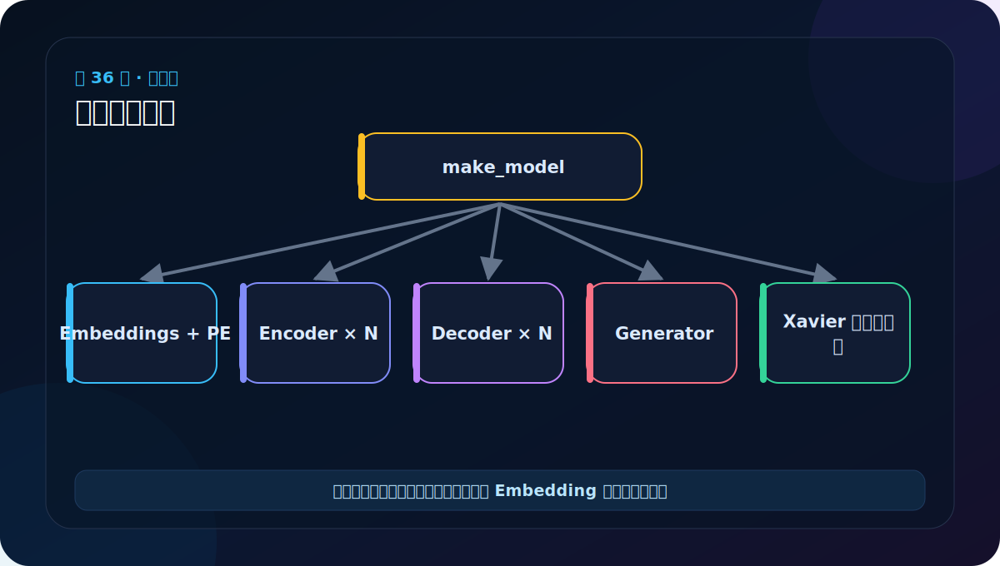

# 第 36 节：完整模型组装：make_model 把所有组件接起来

> 笔记编号 36/38 · 对应原视频 P141 · [打开这一集](https://www.bilibili.com/video/BV14mdfBDE4Q?p=141)

[← 上一节：35 完整模型下：encode/decode 接口要分清](./35-full-transformer-lower.md) · [返回总目录](./README.md) · [下一节：37 组件总复盘：从模型树反向读出数据流 →](./37-transformer-components-review.md)

## 这节解决什么问题

make_model 创建 Attention、FFN、Encoder、Decoder、两侧输入组件和 Generator，再对矩阵参数做 Xavier 初始化。



图要沿箭头或结构层级阅读。先说清楚数据从哪里来、形状怎样变化，再记组件名称。

## 老师原声整理稿（按讲解顺序）

### 0:00–3:47　make_model 是“装配工厂”

老师把整个 Transformer 类比为科研/工程团队自己搭完整架构。前面已经分别制造零件，make_model 负责按照配置创建并连接，不再加入新公式。

函数接收源/目标词表大小、N、d_model、d_ff、h、dropout 等。默认配置可接近论文，测试时应允许缩小。

### 3:47–7:37　先创建可复用的基础组件

```python
attn = MultiHeadedAttention(h, d_model)
ff = PositionwiseFeedForward(d_model, d_ff, dropout)
position = PositionalEncoding(d_model, dropout)
```

接着 EncoderLayer 使用 attn、ff；DecoderLayer 需要两套独立 attention，因此通过 deepcopy 复制。Encoder/Decoder 再各堆 N 层。

深拷贝的原则贯穿全章：结构模板可相同，学习参数必须独立。

### 7:37–12:07　源侧与目标侧输入要分别建立

源输入与目标输入都可用 Sequential：

```python
src_embed = nn.Sequential(
    Embeddings(src_vocab, d_model),
    copy.deepcopy(position),
)
tgt_embed = nn.Sequential(
    Embeddings(tgt_vocab, d_model),
    copy.deepcopy(position),
)
```

两侧词表可能不同，Embedding 绝不能无条件共享。位置编码可以按相同固定公式构造，但各 Sequential 内保留自己的模块对象更清楚。

### 12:07–16:56　三类注意力如何装入整模

老师再次口述：

- Encoder self-attn：Q=K=V=源表示；
- Decoder self-attn：Q=K=V=目标表示，带 tgt_mask；
- Cross-attn：Q=目标，K=V=源 memory，带 src_mask。

这些都使用同一个 MultiHeadedAttention 类，区别由输入来源与 mask 决定。

### 16:56–19:49　完成 Decoder 与 Generator

Decoder 由 DecoderLayer×N 与最终 LayerNorm 组成；Generator 接收 d_model 与 tgt_vocab。

完整顶层包含 src_embed、encoder、tgt_embed、decoder、generator。随后可遍历参数，对维度>1 的权重应用 Xavier 初始化。初始化改善训练起点，但不会修复错误连线。

本节真正检查点是：两侧 vocab 是否用对、注意力对象是否独立、N 是否正确、所有子模块是否注册。

## 辅助流程图


## 完整原声逐段记录

[查看本节按时间戳整理的完整音轨转写](./transcripts/p141.md)

这份逐段记录用于核查老师讲过的内容是否遗漏；学习时优先阅读上面的校正文章，遇到想追溯的细节再按时间戳查看原声记录。

## 零基础先记住

- 源/目标 Embedding 不应无条件共享，因为词表可能不同
- 重复层和注意力模块用 deepcopy 保证参数独立
- Xavier 初始化帮助信号在深层网络中保持合理尺度

## 最小可运行代码

下面代码默认从项目根目录运行。涉及模型组件时，使用 [transformer_from_scratch](../../transformer_from_scratch/README.md) 中经过测试的 PyTorch 实现。

```python
from transformer_from_scratch.model import make_model
model = make_model(src_vocab=31, tgt_vocab=37, n=2,
                   d_model=16, d_ff=32, h=4, dropout=0.0)
print(type(model).__name__)
print(sum(p.numel() for p in model.parameters()))
```

### 输入和输出怎么看

输出 EncoderDecoder 和总参数量，说明所有子模块已注册进模型树。

## 最容易踩的坑

参数量大于 0 不代表连接正确；仍需端到端前向和组件性质测试。

## 本节知识链

`创建基础组件 → 深拷贝层 → 连接整模 → Xavier 初始化`

Transformer 学习的主线始终是形状。每经过一个箭头，都问自己：batch、序列长度、特征维、头数和词表维中的哪一个发生了变化？

## 自测

**问题：为什么 src_vocab=31、tgt_vocab=37 时不能把源 Embedding 深拷贝给目标侧？**

<details>
<summary>点开核对答案</summary>

两张表行数不同，目标 ID 最高可到 36，31 行的源表会越界。

</details>

## 学完检查

- [ ] 我能不用术语解释本节组件解决的问题
- [ ] 我能在运行前写出关键张量形状
- [ ] 我能指出 Q、K、V 或 mask 的来源
- [ ] 我知道代码“形状正确但逻辑可能错误”的情况
- [ ] 我能独立回答自测题

[← 上一节：35 完整模型下：encode/decode 接口要分清](./35-full-transformer-lower.md) · [返回总目录](./README.md) · [下一节：37 组件总复盘：从模型树反向读出数据流 →](./37-transformer-components-review.md)
