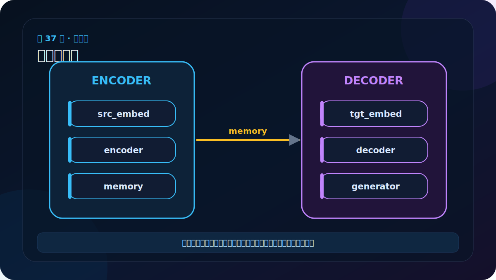
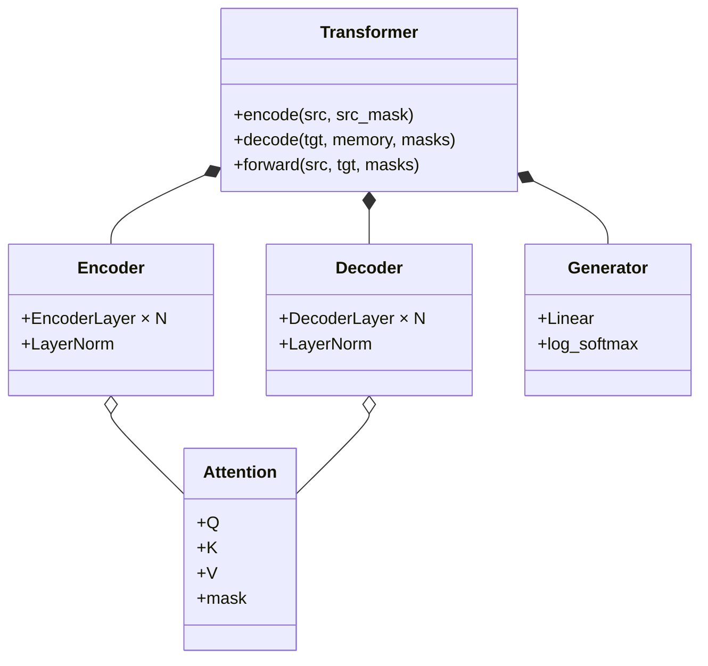

# 第 37 节：组件总复盘：从模型树反向读出数据流

> 笔记编号 37/38 · 对应原视频 P142 · [打开这一集](https://www.bilibili.com/video/BV14mdfBDE4Q?p=142)

[← 上一节：36 完整模型组装：make_model 把所有组件接起来](./36-transformer-test-upper.md) · [返回总目录](./README.md) · [下一节：38 完整模型端到端测试：最终输出不等于训练完成 →](./38-transformer-test-lower.md)

## 这节解决什么问题

看到模型树时，不要被缩进吓住。沿 src_embed→encoder→memory→tgt_embed→decoder→generator 追踪，就能把嵌套结构还原成一条主线。



图要沿箭头或结构层级阅读。先说清楚数据从哪里来、形状怎样变化，再记组件名称。

## 老师原声整理稿（按讲解顺序）

### 0:00–3:54　Sequential 把 Embedding 与 PE 串成输入端

老师继续完成 make_model 中源/目标输入处理。nn.Sequential 保证 token ID 先经过 Embeddings，再经过 PositionalEncoding。只需传入一个 x，内部按顺序调用。

目标输入也必须使用 tgt_vocab；Generator 同样使用 tgt_vocab。位置编码对象可 deepcopy，避免模块层级引用混乱。

### 3:54–6:51　打印模型树先看五个顶层名字

整棵树非常长，老师建议先忽略内部 Linear/Dropout，找到：

1. src_embed；
2. encoder；
3. tgt_embed；
4. decoder；
5. generator。

再按 forward 把它们连成主线。若一开始钻进第四个 Linear 的细节，很容易失去整体方向。

### 6:51–9:49　展开 Encoder 层级

Encoder 下面有 N 个 EncoderLayer；每层两个 SublayerConnection：

- Multi-Head Self-Attention；
- Position-wise FFN。

每个外壳中还能看到 LayerNorm 与 Dropout；Attention 中有四个 Linear，FFN 中有两个。模型树缩进正对应组合关系。

### 9:49–13:06　展开 Decoder 与输出

目标输入仍是 Embedding+PE。每个 DecoderLayer 有三个子层：

1. masked self-attention，防止偷看未来；
2. cross-attention，读取 Encoder memory；
3. FFN。

Decoder 顶部再 LayerNorm，Generator 将 D 映射到 Vt 并 log_softmax。

### 三条复习线

老师整节实际上给出三种读法：

- **模块线**：输入→Encoder→Decoder→Generator；
- **形状线**：[B,L]→[B,L,D]→拆出 h/d_k→[B,Lt,D]→[B,Lt,Vt]；
- **QKV 线**：源自注意力同源、目标自注意力同源、交叉注意力 Q 与 K/V 异源。

能同时沿三条线解释模型树，才算真正看懂“组合完整模型”。

## 辅助流程图


### 组件层级图



## 完整原声逐段记录

[查看本节按时间戳整理的完整音轨转写](./transcripts/p142.md)

这份逐段记录用于核查老师讲过的内容是否遗漏；学习时优先阅读上面的校正文章，遇到想追溯的细节再按时间戳查看原声记录。

## 零基础先记住

- 模块树回答“有哪些参数化组件”
- shape 主线回答“数据怎么走”
- Q/K/V 表回答“三种注意力各读哪里”

## 最小可运行代码

下面代码默认从项目根目录运行。涉及模型组件时，使用 [transformer_from_scratch](../../transformer_from_scratch/README.md) 中经过测试的 PyTorch 实现。

```python
qkv = [
    ("Encoder self", "src", "src", "src"),
    ("Decoder self", "tgt", "tgt", "tgt"),
    ("Cross", "tgt", "memory", "memory"),
]
for name, q, k, v in qkv:
    print(f"{name:12} Q={q:6} K={k:6} V={v}")
```

### 输入和输出怎么看

输出三组 Q/K/V 来源。这张表是排查 Transformer 连接错误的核心速查表。

## 最容易踩的坑

只背类名不追踪张量，遇到变长序列或 mask 广播就容易断层。

## 本节知识链

`模型树 → shape 主线 → 三组 Q/K/V → 逐层定位`

Transformer 学习的主线始终是形状。每经过一个箭头，都问自己：batch、序列长度、特征维、头数和词表维中的哪一个发生了变化？

## 自测

**问题：完整模型中哪三个地方会改变最后一维大小？**

<details>
<summary>点开核对答案</summary>

Embedding 把 ID 变为 D，FFN 中间暂时 D→d_ff→D，Generator 最终 D→Vt。

</details>

## 学完检查

- [ ] 我能不用术语解释本节组件解决的问题
- [ ] 我能在运行前写出关键张量形状
- [ ] 我能指出 Q、K、V 或 mask 的来源
- [ ] 我知道代码“形状正确但逻辑可能错误”的情况
- [ ] 我能独立回答自测题

[← 上一节：36 完整模型组装：make_model 把所有组件接起来](./36-transformer-test-upper.md) · [返回总目录](./README.md) · [下一节：38 完整模型端到端测试：最终输出不等于训练完成 →](./38-transformer-test-lower.md)
