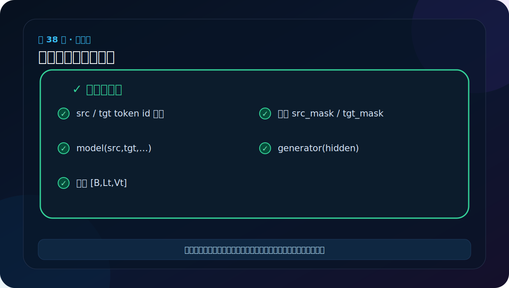
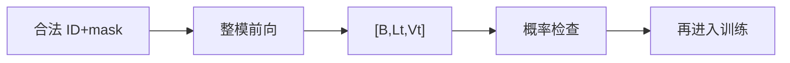

# 第 38 节：完整模型端到端测试：最终输出不等于训练完成

> 笔记编号 38/38 · 对应原视频 P143 · [打开这一集](https://www.bilibili.com/video/BV14mdfBDE4Q?p=143)

[← 上一节：37 组件总复盘：从模型树反向读出数据流](./37-transformer-components-review.md) · [返回总目录](./README.md) · 已是最后一节 →

## 这节解决什么问题

端到端测试构造合法源/目标 ID 和两种 mask，执行整模前向，检查输出 [B,Lt,Vt] 与概率归一化。



图要沿箭头或结构层级阅读。先说清楚数据从哪里来、形状怎样变化，再记组件名称。

## 老师原声整理稿（按讲解顺序）

### 0:00–3:56　准备整模、源目标 ID 与 mask

老师最后创建完整 Transformer，并准备 src、tgt、src_mask、tgt_mask。ID 必须在各自词表范围内；src 与 tgt 可以有不同长度。

tgt 训练输入应是右移后的目标前缀，tgt_mask 组合因果下三角与 PAD 可见性。课堂为了跑通可能使用简化 mask，学习笔记需要记住真实训练不能省略这些语义。

### 3:56–6:54　端到端前向第一次暴露连接错误

执行前向后，控制台出现维度/调用问题。老师没有重写整个模型，而是沿 traceback 回到 EncoderDecoder.forward、encode 与 encoder 对象的调用处。

整模测试的价值正是覆盖局部测试没覆盖的参数顺序、方法返回与组件连接。

### 6:54–10:49　课堂现场修复：调用错对象/名称多写字符

老师逐层定位到 forward 中调用编码结果的位置，发现名称或方法写错（音轨中可听到多写一个字母、把 encoder/encode 混淆的排查）。修复后重新运行。

这与前面提醒呼应：

- encoder 是模块；
- encode 是方法；
- 辅助函数必须 return；
- 复制代码后要检查变量名。

看 traceback 时从最底部异常消息向上找自己项目的第一行，而不是被长模型树吓住。

### 10:49–12:48　跑通后按层级总结

老师回顾 N 个 EncoderLayer、N 个 DecoderLayer 与最终全局 LayerNorm。还强调完整代码是自己按论文组件搭出来的教育实现，能帮助理解底层，但生产库可能采用更高效内核、不同归一化顺序和缓存。

### 端到端验收应做什么

完整输出应为 [B,Lt,Vt]。除“不报错”外，还应：

- `exp(log_probs).sum(-1)` 接近 1；
- 不同 Ls/Lt 能正常广播；
- mask 区注意力为 0；
- eval/no_grad 下重复输出一致；
- backward 能让主要参数获得梯度。

整模前向跑通只是架构实现终点，不是翻译训练终点。真正系统还需要数据批处理、目标右移、PAD loss 忽略、优化器与调度、保存加载，以及贪心/采样/beam search 自回归生成。

## 辅助流程图




## 完整原声逐段记录

[查看本节按时间戳整理的完整音轨转写](./transcripts/p143.md)

这份逐段记录用于核查老师讲过的内容是否遗漏；学习时优先阅读上面的校正文章，遇到想追溯的细节再按时间戳查看原声记录。

## 零基础先记住

- 测试同时覆盖嵌入范围、mask 广播和编码解码连接
- model.eval()+torch.no_grad() 让测试确定且省显存
- 前向通过只证明结构可运行，训练还需数据、目标右移、损失和解码

## 最小可运行代码

下面代码默认从项目根目录运行。涉及模型组件时，使用 [transformer_from_scratch](../../transformer_from_scratch/README.md) 中经过测试的 PyTorch 实现。

```python
import torch
from transformer_from_scratch.model import make_model, subsequent_mask
model = make_model(31,37,n=2,d_model=16,d_ff=32,h=4,dropout=0.0).eval()
src, tgt = torch.randint(0,31,(2,6)), torch.randint(0,37,(2,5))
with torch.no_grad():
    y = model(src, tgt, torch.ones(2,1,6,dtype=torch.bool), subsequent_mask(5))
print(y.shape, torch.allclose(y.exp().sum(-1), torch.ones(2,5), atol=1e-5))
```

### 输入和输出怎么看

输出 [2,5,37] 和 True，说明每个目标位置都有合法的目标词表概率分布。

## 最容易踩的坑

这不是完整翻译系统。还缺 padding mask 合并、目标右移、损失、优化器、学习率调度与自回归解码。

## 本节知识链

`合法 ID+mask → 整模前向 → [B,Lt,Vt] → 概率检查 → 再进入训练`

Transformer 学习的主线始终是形状。每经过一个箭头，都问自己：batch、序列长度、特征维、头数和词表维中的哪一个发生了变化？

## 自测

**问题：为什么模型输入 tgt 不能包含正在预测位置之后的真实词信息？**

<details>
<summary>点开核对答案</summary>

否则训练时会偷看答案；必须右移目标，并用因果 mask 限制可见范围。

</details>

## 学完检查

- [ ] 我能不用术语解释本节组件解决的问题
- [ ] 我能在运行前写出关键张量形状
- [ ] 我能指出 Q、K、V 或 mask 的来源
- [ ] 我知道代码“形状正确但逻辑可能错误”的情况
- [ ] 我能独立回答自测题

[← 上一节：37 组件总复盘：从模型树反向读出数据流](./37-transformer-components-review.md) · [返回总目录](./README.md) · 已是最后一节 →
